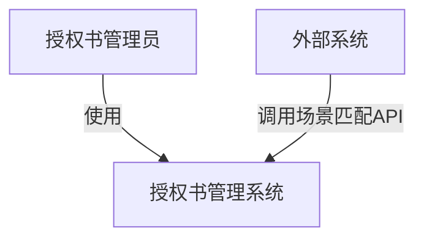
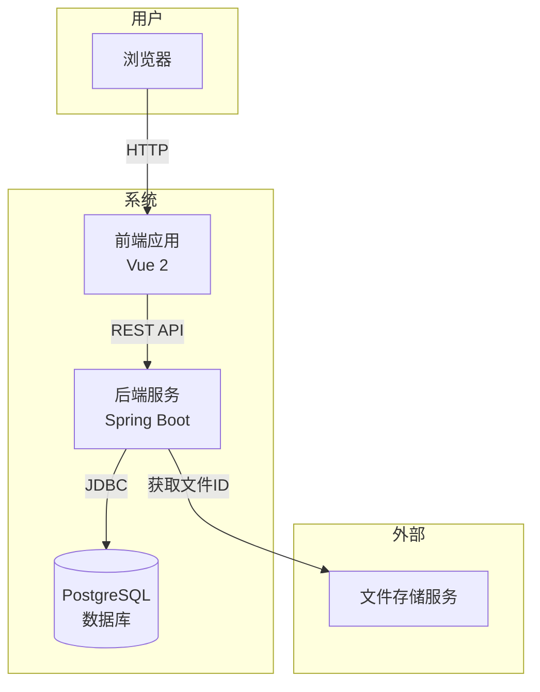
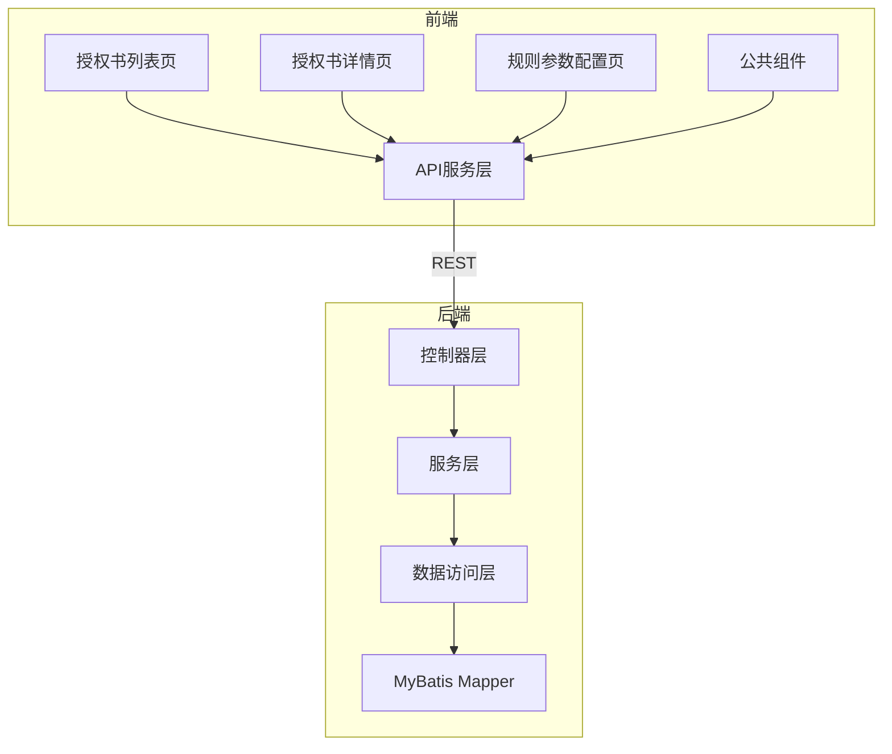
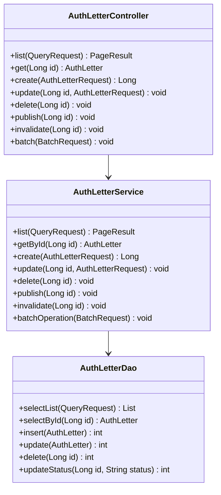
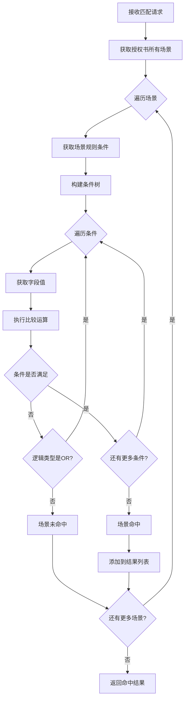
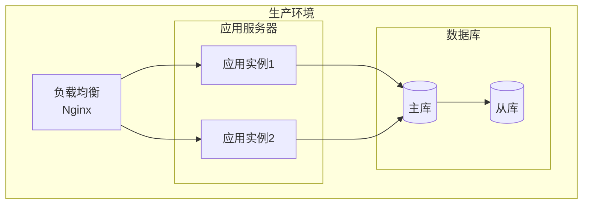

# 授权书管理系统 - 技术架构设计

## 1. 系统架构概述

### 1.1 C4 架构模型 - 系统上下文图



### 1.2 C4 架构模型 - 容器图



### 1.3 C4 架构模型 - 组件图



## 2. 技术栈选型

### 2.1 前端技术栈

| 技术 | 版本 | 选型理由 |
|------|------|----------|
| Vue | 2.6.x | 用户指定，成熟稳定 |
| Vue Router | 3.x | 路由管理 |
| Vuex | 3.x | 状态管理 |
| Element UI | 2.15.x | UI组件库，功能完善 |
| Axios | 0.27.x | HTTP请求库 |
| ECharts | 5.x | 图表展示（可选） |

### 2.2 后端技术栈

| 技术 | 版本 | 选型理由 |
|------|------|----------|
| Java | JDK 8 | 用户指定，企业主流 |
| Spring Boot | 2.7.x | 快速开发框架 |
| MyBatis | 3.5.x | ORM框架，灵活SQL |
| PostgreSQL | 13+ | 用户指定，支持JSONB |
| Flyway | 8.x | 数据库版本管理 |
| Lombok | 1.18.x | 简化代码 |
| Maven | 3.6+ | 项目构建 |

### 2.3 开发工具

| 工具 | 用途 |
|------|------|
| Git | 版本控制 |
| IDEA | 后端开发IDE |
| VS Code | 前端开发IDE |
| Postman | API测试 |
| DBeaver | 数据库管理 |

## 3. 项目目录结构

```
authorization-management-v6/
├── backend/                          # 后端项目
│   ├── pom.xml                       # Maven配置
│   ├── src/
│   │   ├── main/
│   │   │   ├── java/com/auth/letter/
│   │   │   │   ├── AuthLetterApplication.java
│   │   │   │   ├── config/           # 配置类
│   │   │   │   │   ├── MyBatisConfig.java
│   │   │   │   │   ├── WebConfig.java
│   │   │   │   │   └── CorsConfig.java
│   │   │   │   ├── controller/       # 控制器层
│   │   │   │   │   ├── AuthLetterController.java
│   │   │   │   │   ├── SceneController.java
│   │   │   │   │   ├── RuleParamController.java
│   │   │   │   │   ├── AttachmentController.java
│   │   │   │   │   ├── LookupController.java
│   │   │   │   │   └── SceneMatchController.java
│   │   │   │   ├── service/          # 服务层
│   │   │   │   │   ├── AuthLetterService.java
│   │   │   │   │   ├── SceneService.java
│   │   │   │   │   ├── RuleParamService.java
│   │   │   │   │   ├── AttachmentService.java
│   │   │   │   │   ├── LookupService.java
│   │   │   │   │   └── SceneMatchService.java
│   │   │   │   ├── dao/              # 数据访问层
│   │   │   │   │   ├── AuthLetterDao.java
│   │   │   │   │   ├── SceneDao.java
│   │   │   │   │   ├── RuleParamDao.java
│   │   │   │   │   ├── AttachmentDao.java
│   │   │   │   │   └── LookupDao.java
│   │   │   │   ├── entity/           # 实体类
│   │   │   │   │   ├── AuthLetter.java
│   │   │   │   │   ├── Scene.java
│   │   │   │   │   ├── Rule.java
│   │   │   │   │   ├── RuleCondition.java
│   │   │   │   │   ├── Attachment.java
│   │   │   │   │   ├── RuleParam.java
│   │   │   │   │   ├── LookupType.java
│   │   │   │   │   └── LookupValue.java
│   │   │   │   ├── dto/              # 数据传输对象
│   │   │   │   │   ├── request/
│   │   │   │   │   └── response/
│   │   │   │   ├── common/           # 公共类
│   │   │   │   │   ├── Result.java
│   │   │   │   │   ├── PageResult.java
│   │   │   │   │   └── Constants.java
│   │   │   │   └── util/             # 工具类
│   │   │   └── resources/
│   │   │       ├── application.yml   # 应用配置
│   │   │       ├── application-dev.yml
│   │   │       ├── application-prod.yml
│   │   │       ├── db/migration/     # Flyway迁移脚本
│   │   │       │   ├── V1__init_schema.sql
│   │   │       │   ├── V2__init_lookup_data.sql
│   │   │       │   └── V3__init_rule_param_data.sql
│   │   │       └── mapper/           # MyBatis映射文件
│   │   │           ├── AuthLetterDao.xml
│   │   │           ├── SceneDao.xml
│   │   │           ├── RuleParamDao.xml
│   │   │           ├── AttachmentDao.xml
│   │   │           └── LookupDao.xml
│   │   └── test/                     # 测试代码
│   └── target/
│
├── frontend/                         # 前端项目
│   ├── package.json
│   ├── vue.config.js
│   ├── public/
│   │   └── index.html
│   └── src/
│       ├── main.js
│       ├── App.vue
│       ├── router/                   # 路由配置
│       │   └── index.js
│       ├── store/                    # Vuex状态管理
│       │   ├── index.js
│       │   └── modules/
│       ├── views/                    # 页面组件
│       │   ├── AuthLetterList.vue
│       │   ├── AuthLetterDetail.vue
│       │   └── RuleParamConfig.vue
│       ├── components/               # 公共组件
│       │   ├── TreeSelect.vue        # 树形选择器
│       │   ├── FlatSelect.vue        # 平铺列表选择器
│       │   ├── RuleConfig.vue        # 规则配置组件
│       │   ├── ConditionGroup.vue    # 条件组组件
│       │   └── QuestionnaireDesign.vue # 问卷设计组件
│       ├── api/                      # API接口
│       │   ├── authLetter.js
│       │   ├── scene.js
│       │   ├── ruleParam.js
│       │   ├── attachment.js
│       │   └── lookup.js
│       ├── utils/                    # 工具函数
│       │   ├── request.js
│       │   └── common.js
│       └── assets/                   # 静态资源
│           └── styles/
│
└── docs/                             # 文档目录
    ├── requirements.md
    ├── database-design.md
    ├── api-design.md
    └── architecture-design.md
```

## 4. 核心模块设计

### 4.1 授权书模块



### 4.2 场景匹配模块



## 5. 扩展性设计

### 5.1 水平扩展
- 无状态服务设计，支持多实例部署
- 使用Nginx进行负载均衡
- 数据库连接池配置

### 5.2 缓存策略
- Lookup数据缓存（本地缓存）
- 规则参数缓存（Redis可选）
- 场景匹配结果缓存（可选）

### 5.3 性能优化
- 数据库索引优化
- 分页查询优化
- JSON字段使用PostgreSQL JSONB类型

## 6. 安全设计

### 6.1 接口安全
- CORS配置
- XSS防护
- SQL注入防护（MyBatis参数化查询）

### 6.2 数据安全
- 逻辑删除
- 操作日志记录
- 敏感数据加密（预留）

## 7. 部署架构

