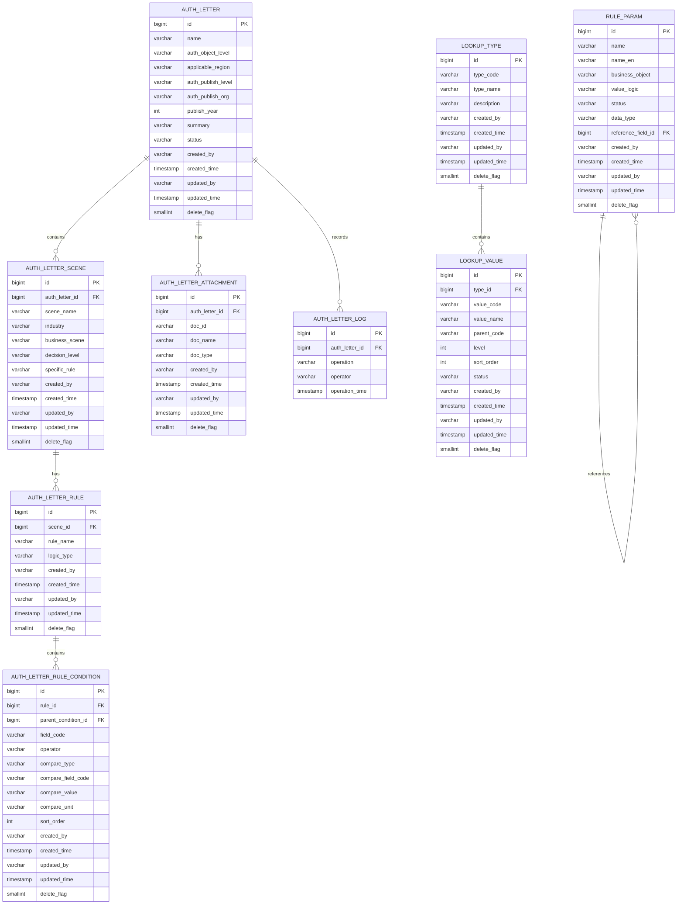

# 授权书管理系统 - 数据库设计

## 1. 概述

本文档定义授权书管理系统的数据库表结构设计，遵循以下原则：
- 使用 PostgreSQL 数据库
- 禁止外键约束，通过应用层维护关联关系
- 所有表包含标准审计字段
- 使用逻辑删除

## 2. ER 图



## 3. 表结构详细设计

### 3.1 授权书主表 (auth_letter)

| 字段名 | 类型 | 是否必填 | 默认值 | 说明 |
|--------|------|----------|--------|------|
| id | BIGSERIAL | 是 | 自增 | 主键ID |
| name | VARCHAR(200) | 是 | - | 授权书名称 |
| auth_object_level | VARCHAR(500) | 是 | - | 授权对象层级，JSON数组格式存储多选值 |
| applicable_region | VARCHAR(2000) | 是 | - | 适用区域，JSON数组格式存储树形多选值 |
| auth_publish_level | VARCHAR(500) | 是 | - | 授权发布层级，JSON数组格式存储多选值 |
| auth_publish_org | VARCHAR(2000) | 是 | - | 授权发布组织，JSON数组格式存储树形多选值 |
| publish_year | INT | 是 | - | 授权书发布年份 |
| summary | VARCHAR(4000) | 是 | - | 授权书内容摘要 |
| status | VARCHAR(20) | 是 | 'DRAFT' | 状态：DRAFT-草稿，PUBLISHED-已发布，INVALID-已失效 |
| created_by | VARCHAR(64) | 是 | - | 创建人 |
| created_time | TIMESTAMP | 是 | CURRENT_TIMESTAMP | 创建时间 |
| updated_by | VARCHAR(64) | 否 | - | 最后更新人 |
| updated_time | TIMESTAMP | 否 | - | 最后更新时间 |
| delete_flag | SMALLINT | 是 | 0 | 逻辑删除标识：0-未删除，1-已删除 |

**索引设计：**
- idx_auth_letter_name ON auth_letter(name)
- idx_auth_letter_status ON auth_letter(status)
- idx_auth_letter_publish_year ON auth_letter(publish_year)
- idx_auth_letter_created_time ON auth_letter(created_time)

### 3.2 场景表 (auth_letter_scene)

| 字段名 | 类型 | 是否必填 | 默认值 | 说明 |
|--------|------|----------|--------|------|
| id | BIGSERIAL | 是 | 自增 | 主键ID |
| auth_letter_id | BIGINT | 是 | - | 授权书ID |
| scene_name | VARCHAR(200) | 是 | - | 场景名称 |
| industry | VARCHAR(2000) | 是 | - | 产业，JSON数组格式存储树形多选值 |
| business_scene | VARCHAR(200) | 是 | - | 业务场景 |
| decision_level | VARCHAR(200) | 是 | - | 决策层级 |
| specific_rule | VARCHAR(1000) | 是 | - | 具体规则 |
| questionnaire | TEXT | 否 | - | 问卷设计，JSON格式存储 |
| created_by | VARCHAR(64) | 是 | - | 创建人 |
| created_time | TIMESTAMP | 是 | CURRENT_TIMESTAMP | 创建时间 |
| updated_by | VARCHAR(64) | 否 | - | 最后更新人 |
| updated_time | TIMESTAMP | 否 | - | 最后更新时间 |
| delete_flag | SMALLINT | 是 | 0 | 逻辑删除标识 |

**索引设计：**
- idx_scene_auth_letter_id ON auth_letter_scene(auth_letter_id)

### 3.3 规则表 (auth_letter_rule)

| 字段名 | 类型 | 是否必填 | 默认值 | 说明 |
|--------|------|----------|--------|------|
| id | BIGSERIAL | 是 | 自增 | 主键ID |
| scene_id | BIGINT | 是 | - | 场景ID |
| rule_name | VARCHAR(200) | 否 | - | 规则名称 |
| logic_type | VARCHAR(20) | 是 | 'AND' | 逻辑类型：AND-且，OR-或 |
| created_by | VARCHAR(64) | 是 | - | 创建人 |
| created_time | TIMESTAMP | 是 | CURRENT_TIMESTAMP | 创建时间 |
| updated_by | VARCHAR(64) | 否 | - | 最后更新人 |
| updated_time | TIMESTAMP | 否 | - | 最后更新时间 |
| delete_flag | SMALLINT | 是 | 0 | 逻辑删除标识 |

**索引设计：**
- idx_rule_scene_id ON auth_letter_rule(scene_id)

### 3.4 规则条件表 (auth_letter_rule_condition)

| 字段名 | 类型 | 是否必填 | 默认值 | 说明 |
|--------|------|----------|--------|------|
| id | BIGSERIAL | 是 | 自增 | 主键ID |
| rule_id | BIGINT | 是 | - | 规则ID |
| parent_condition_id | BIGINT | 否 | NULL | 父条件ID，用于条件组嵌套 |
| field_code | VARCHAR(100) | 是 | - | 规则字段编码 |
| operator | VARCHAR(20) | 是 | - | 运算符：>, <, =, >=, <=, != |
| compare_type | VARCHAR(50) | 是 | - | 对比类型：FIELD-字段，NUMBER-数值，TEXT-文本，RATIO-比例 |
| compare_field_code | VARCHAR(100) | 否 | - | 对比字段编码（compare_type=FIELD时使用） |
| compare_value | VARCHAR(500) | 否 | - | 对比值 |
| compare_unit | VARCHAR(50) | 否 | - | 计量单位 |
| logic_type | VARCHAR(20) | 是 | 'AND' | 与上一条件的连接逻辑：AND-且，OR-或 |
| is_group | SMALLINT | 是 | 0 | 是否为条件组：0-否，1-是 |
| group_logic_type | VARCHAR(20) | 否 | - | 条件组内部逻辑：AND-且，OR-或 |
| sort_order | INT | 是 | 0 | 排序序号 |
| created_by | VARCHAR(64) | 是 | - | 创建人 |
| created_time | TIMESTAMP | 是 | CURRENT_TIMESTAMP | 创建时间 |
| updated_by | VARCHAR(64) | 否 | - | 最后更新人 |
| updated_time | TIMESTAMP | 否 | - | 最后更新时间 |
| delete_flag | SMALLINT | 是 | 0 | 逻辑删除标识 |

**索引设计：**
- idx_condition_rule_id ON auth_letter_rule_condition(rule_id)
- idx_condition_parent_id ON auth_letter_rule_condition(parent_condition_id)

### 3.5 附件表 (auth_letter_attachment)

| 字段名 | 类型 | 是否必填 | 默认值 | 说明 |
|--------|------|----------|--------|------|
| id | BIGSERIAL | 是 | 自增 | 主键ID |
| auth_letter_id | BIGINT | 是 | - | 授权书ID |
| doc_id | VARCHAR(100) | 是 | - | 文档ID |
| doc_name | VARCHAR(500) | 是 | - | 文档名称 |
| doc_type | VARCHAR(50) | 是 | - | 文档类型 |
| is_encrypted | SMALLINT | 是 | 0 | 是否加密：0-否，1-是 |
| created_by | VARCHAR(64) | 是 | - | 创建人 |
| created_time | TIMESTAMP | 是 | CURRENT_TIMESTAMP | 创建时间 |
| updated_by | VARCHAR(64) | 否 | - | 最后更新人 |
| updated_time | TIMESTAMP | 否 | - | 最后更新时间 |
| delete_flag | SMALLINT | 是 | 0 | 逻辑删除标识 |

**索引设计：**
- idx_attachment_auth_letter_id ON auth_letter_attachment(auth_letter_id)

### 3.6 操作日志表 (auth_letter_log)

| 字段名 | 类型 | 是否必填 | 默认值 | 说明 |
|--------|------|----------|--------|------|
| id | BIGSERIAL | 是 | 自增 | 主键ID |
| auth_letter_id | BIGINT | 是 | - | 授权书ID |
| operation | VARCHAR(100) | 是 | - | 操作类型：CREATE-创建，UPDATE-更新，PUBLISH-发布，INVALID-失效，DELETE-删除 |
| operator | VARCHAR(64) | 是 | - | 操作人 |
| operation_time | TIMESTAMP | 是 | CURRENT_TIMESTAMP | 操作时间 |

**索引设计：**
- idx_log_auth_letter_id ON auth_letter_log(auth_letter_id)
- idx_log_operation_time ON auth_letter_log(operation_time)

### 3.7 规则参数配置表 (rule_param)

| 字段名 | 类型 | 是否必填 | 默认值 | 说明 |
|--------|------|----------|--------|------|
| id | BIGSERIAL | 是 | 自增 | 主键ID |
| name | VARCHAR(200) | 是 | - | 名称 |
| name_en | VARCHAR(200) | 是 | - | 名称英文 |
| business_object | VARCHAR(200) | 否 | - | 业务对象 |
| value_logic | VARCHAR(500) | 否 | - | 取值逻辑 |
| status | VARCHAR(20) | 是 | 'ACTIVE' | 状态：ACTIVE-生效，INACTIVE-失效 |
| data_type | VARCHAR(50) | 是 | - | 数据类型：TEXT-文本，NUMBER-数值，FIELD-比对字段，RATIO-比率 |
| reference_field_id | BIGINT | 否 | - | 关联字段ID（data_type=FIELD时使用） |
| created_by | VARCHAR(64) | 是 | - | 创建人 |
| created_time | TIMESTAMP | 是 | CURRENT_TIMESTAMP | 创建时间 |
| updated_by | VARCHAR(64) | 否 | - | 最后更新人 |
| updated_time | TIMESTAMP | 否 | - | 最后更新时间 |
| delete_flag | SMALLINT | 是 | 0 | 逻辑删除标识 |

**索引设计：**
- idx_rule_param_name ON rule_param(name)
- idx_rule_param_name_en ON rule_param(name_en)
- idx_rule_param_status ON rule_param(status)

### 3.8 下拉类型表 (lookup_type)

| 字段名 | 类型 | 是否必填 | 默认值 | 说明 |
|--------|------|----------|--------|------|
| id | BIGSERIAL | 是 | 自增 | 主键ID |
| type_code | VARCHAR(100) | 是 | - | 类型编码，唯一 |
| type_name | VARCHAR(200) | 是 | - | 类型名称 |
| description | VARCHAR(500) | 否 | - | 描述 |
| created_by | VARCHAR(64) | 是 | - | 创建人 |
| created_time | TIMESTAMP | 是 | CURRENT_TIMESTAMP | 创建时间 |
| updated_by | VARCHAR(64) | 否 | - | 最后更新人 |
| updated_time | TIMESTAMP | 否 | - | 最后更新时间 |
| delete_flag | SMALLINT | 是 | 0 | 逻辑删除标识 |

**索引设计：**
- uk_lookup_type_code ON lookup_type(type_code) UNIQUE

### 3.9 下拉值表 (lookup_value)

| 字段名 | 类型 | 是否必填 | 默认值 | 说明 |
|--------|------|----------|--------|------|
| id | BIGSERIAL | 是 | 自增 | 主键ID |
| type_id | BIGINT | 是 | - | 类型ID |
| value_code | VARCHAR(100) | 是 | - | 值编码 |
| value_name | VARCHAR(200) | 是 | - | 值名称 |
| parent_code | VARCHAR(100) | 否 | - | 父节点编码（用于树形结构） |
| level | INT | 是 | 1 | 层级：1-一级，2-二级，3-三级 |
| sort_order | INT | 是 | 0 | 排序序号 |
| status | VARCHAR(20) | 是 | 'ACTIVE' | 状态：ACTIVE-生效，INACTIVE-失效 |
| created_by | VARCHAR(64) | 是 | - | 创建人 |
| created_time | TIMESTAMP | 是 | CURRENT_TIMESTAMP | 创建时间 |
| updated_by | VARCHAR(64) | 否 | - | 最后更新人 |
| updated_time | TIMESTAMP | 否 | - | 最后更新时间 |
| delete_flag | SMALLINT | 是 | 0 | 逻辑删除标识 |

**索引设计：**
- idx_lookup_value_type_id ON lookup_value(type_id)
- idx_lookup_value_parent_code ON lookup_value(parent_code)

## 4. 下拉列表类型预置数据

| 类型编码 | 类型名称 | 说明 |
|----------|----------|------|
| AUTH_OBJECT_LEVEL | 授权对象层级 | 平铺列表，多选 |
| AUTH_PUBLISH_LEVEL | 授权发布层级 | 平铺列表，多选 |
| APPLICABLE_REGION | 适用区域 | 三层树形：机关、地区部、代表处 |
| AUTH_PUBLISH_ORG | 授权发布组织 | 三层树形：机关、地区部、代表处 |
| INDUSTRY | 产业 | 树形结构，多选 |
| BUSINESS_SCENE | 业务场景 | 平铺列表，单选 |
| DECISION_LEVEL | 决策层级 | 平铺列表，单选 |
| DOC_TYPE | 文档类型 | 平铺列表，单选 |
| COMPARE_UNIT | 计量单位 | 平铺列表，包含：千万、兆、币种等 |
| OPERATOR | 运算符 | 平铺列表：>, <, =, >=, <=, != |

## 5. 状态流转说明

授权书状态流转：
```
草稿(DRAFT) --> 已发布(PUBLISHED) --> 已失效(INVALID)
     |                |                   |
     v                v                   v
   删除            删除                删除
```

- 草稿状态：可编辑、可保存、可发布、可删除
- 已发布状态：不可编辑、可失效、可删除
- 已失效状态：不可编辑、可删除