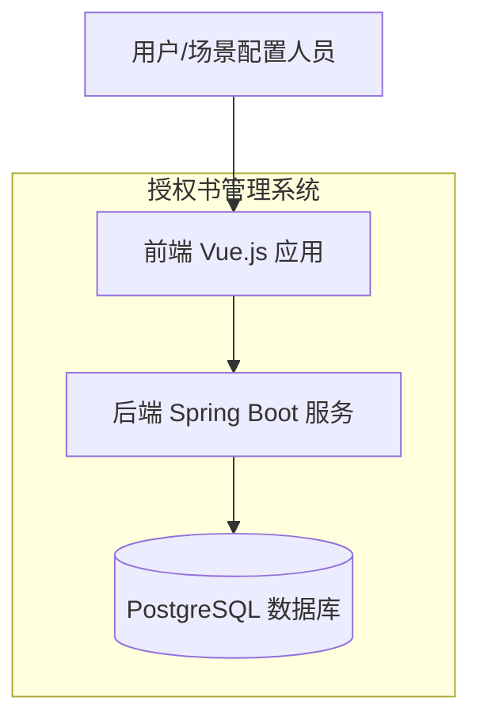
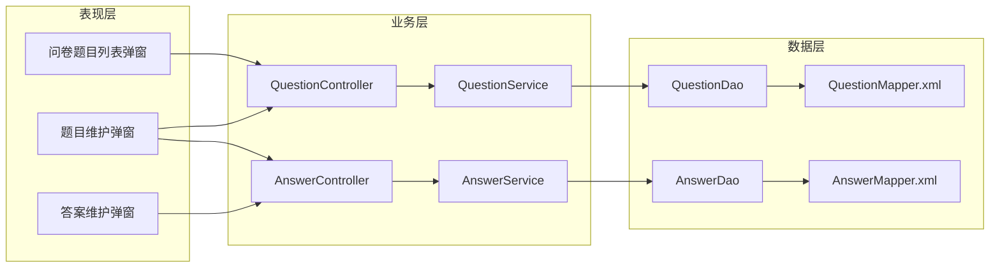
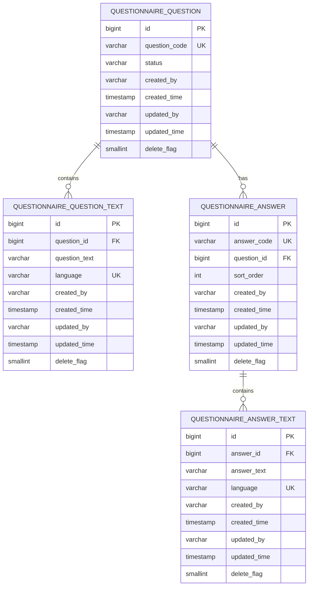

# 问卷题目配置功能架构设计文档

## 1. 架构概述

### 1.1 系统上下文



### 1.2 组件架构



### 1.3 技术栈

| 层级 | 技术选型 | 说明 |
|------|----------|------|
| 前端 | Vue 2 + JavaScript | 与现有项目保持一致 |
| 后端 | Spring Boot 2.7 + Java 8 | 与现有项目保持一致 |
| 数据库 | PostgreSQL 14 | 与现有项目保持一致 |
| ORM | MyBatis | 与现有项目保持一致 |

---

## 2. 数据库设计

### 2.1 ER 图



### 2.2 DDL 脚本

```sql
-- V3__questionnaire_schema.sql
-- 问卷题目配置功能数据库表结构

-- 1. 问卷题目主表
CREATE TABLE IF NOT EXISTS questionnaire_question (
    id BIGSERIAL PRIMARY KEY,
    question_code VARCHAR(50) NOT NULL UNIQUE,
    status VARCHAR(20) NOT NULL DEFAULT 'ACTIVE',
    created_by VARCHAR(64) NOT NULL,
    created_time TIMESTAMP NOT NULL DEFAULT CURRENT_TIMESTAMP,
    updated_by VARCHAR(64),
    updated_time TIMESTAMP,
    delete_flag SMALLINT NOT NULL DEFAULT 0
);

COMMENT ON TABLE questionnaire_question IS '问卷题目主表';
COMMENT ON COLUMN questionnaire_question.id IS '主键ID';
COMMENT ON COLUMN questionnaire_question.question_code IS '题目编号，格式：QT+时间戳';
COMMENT ON COLUMN questionnaire_question.status IS '状态：ACTIVE-生效，INACTIVE-失效';

CREATE INDEX idx_question_code ON questionnaire_question(question_code);
CREATE INDEX idx_question_status ON questionnaire_question(status);
CREATE INDEX idx_question_created_time ON questionnaire_question(created_time);

-- 2. 问卷题目文本表（多语言）
CREATE TABLE IF NOT EXISTS questionnaire_question_text (
    id BIGSERIAL PRIMARY KEY,
    question_id BIGINT NOT NULL,
    question_text VARCHAR(500) NOT NULL,
    language VARCHAR(10) NOT NULL,
    created_by VARCHAR(64) NOT NULL,
    created_time TIMESTAMP NOT NULL DEFAULT CURRENT_TIMESTAMP,
    updated_by VARCHAR(64),
    updated_time TIMESTAMP,
    delete_flag SMALLINT NOT NULL DEFAULT 0,
    CONSTRAINT uk_question_language UNIQUE (question_id, language)
);

COMMENT ON TABLE questionnaire_question_text IS '问卷题目文本表（多语言）';
COMMENT ON COLUMN questionnaire_question_text.id IS '主键ID';
COMMENT ON COLUMN questionnaire_question_text.question_id IS '题目ID';
COMMENT ON COLUMN questionnaire_question_text.question_text IS '题目内容';
COMMENT ON COLUMN questionnaire_question_text.language IS '语言代码：ZH-中文，EN-英文';

CREATE INDEX idx_question_text_question_id ON questionnaire_question_text(question_id);
CREATE INDEX idx_question_text_language ON questionnaire_question_text(language);

-- 3. 问卷答案主表
CREATE TABLE IF NOT EXISTS questionnaire_answer (
    id BIGSERIAL PRIMARY KEY,
    answer_code VARCHAR(50) NOT NULL UNIQUE,
    question_id BIGINT NOT NULL,
    sort_order INT NOT NULL DEFAULT 0,
    created_by VARCHAR(64) NOT NULL,
    created_time TIMESTAMP NOT NULL DEFAULT CURRENT_TIMESTAMP,
    updated_by VARCHAR(64),
    updated_time TIMESTAMP,
    delete_flag SMALLINT NOT NULL DEFAULT 0
);

COMMENT ON TABLE questionnaire_answer IS '问卷答案主表';
COMMENT ON COLUMN questionnaire_answer.id IS '主键ID';
COMMENT ON COLUMN questionnaire_answer.answer_code IS '答案编号，格式：ANS+时间戳';
COMMENT ON COLUMN questionnaire_answer.question_id IS '关联题目ID';
COMMENT ON COLUMN questionnaire_answer.sort_order IS '排序序号';

CREATE INDEX idx_answer_code ON questionnaire_answer(answer_code);
CREATE INDEX idx_answer_question_id ON questionnaire_answer(question_id);
CREATE INDEX idx_answer_sort_order ON questionnaire_answer(sort_order);

-- 4. 问卷答案文本表（多语言）
CREATE TABLE IF NOT EXISTS questionnaire_answer_text (
    id BIGSERIAL PRIMARY KEY,
    answer_id BIGINT NOT NULL,
    answer_text VARCHAR(200) NOT NULL,
    language VARCHAR(10) NOT NULL,
    created_by VARCHAR(64) NOT NULL,
    created_time TIMESTAMP NOT NULL DEFAULT CURRENT_TIMESTAMP,
    updated_by VARCHAR(64),
    updated_time TIMESTAMP,
    delete_flag SMALLINT NOT NULL DEFAULT 0,
    CONSTRAINT uk_answer_language UNIQUE (answer_id, language)
);

COMMENT ON TABLE questionnaire_answer_text IS '问卷答案文本表（多语言）';
COMMENT ON COLUMN questionnaire_answer_text.id IS '主键ID';
COMMENT ON COLUMN questionnaire_answer_text.answer_id IS '答案ID';
COMMENT ON COLUMN questionnaire_answer_text.answer_text IS '答案内容';
COMMENT ON COLUMN questionnaire_answer_text.language IS '语言代码：ZH-中文，EN-英文';

CREATE INDEX idx_answer_text_answer_id ON questionnaire_answer_text(answer_id);
CREATE INDEX idx_answer_text_language ON questionnaire_answer_text(language);

-- 5. 初始化语言Lookup数据
INSERT INTO lookup_type (type_code, type_name, description, created_by)
VALUES ('QUESTIONNAIRE_LANGUAGE', '问卷语言', '问卷内容语言类型', 'system')
ON CONFLICT (type_code) DO NOTHING;

INSERT INTO lookup_value (type_id, value_code, value_name, sort_order, status, created_by)
SELECT id, 'ZH', '中文', 1, 'ACTIVE', 'system' FROM lookup_type WHERE type_code = 'QUESTIONNAIRE_LANGUAGE'
UNION ALL
SELECT id, 'EN', 'English', 2, 'ACTIVE', 'system' FROM lookup_type WHERE type_code = 'QUESTIONNAIRE_LANGUAGE'
ON CONFLICT DO NOTHING;
```

### 2.3 设计说明

#### 为什么采用主表+文本表的分离设计？

1. **多语言支持**：题目和答案需要支持中英文，同一内容的不同语言版本通过主表关联
2. **唯一约束**：`question_id + language` 和 `answer_id + language` 的唯一约束确保每种语言只有一个版本
3. **扩展性**：未来如需支持更多语言，无需修改表结构
4. **查询优化**：按语言过滤时可直接在文本表上建立索引

#### 与场景的关联方式

保持现有的 `auth_letter_scene.questionnaire` 字段，存储关联的题目编号列表（JSON数组）：

```json
["QT20260326001", "QT20260326002"]
```

---

## 3. API 接口契约

### 3.1 接口概览

| 接口 | 方法 | 路径 | 说明 |
|------|------|------|------|
| 题目列表查询 | GET | /api/v1/questions | 分页查询题目列表 |
| 题目详情查询 | GET | /api/v1/questions/{id} | 查询单个题目详情 |
| 创建题目 | POST | /api/v1/questions | 创建新题目（含多语言文本） |
| 更新题目 | PUT | /api/v1/questions/{id} | 更新题目（含多语言文本） |
| 删除题目 | DELETE | /api/v1/questions/{id} | 删除单个题目 |
| 批量删除题目 | POST | /api/v1/questions/batch-delete | 批量删除题目 |
| 答案列表查询 | GET | /api/v1/questions/{questionId}/answers | 查询题目下的答案列表 |
| 创建答案 | POST | /api/v1/questions/{questionId}/answers | 创建新答案 |
| 更新答案 | PUT | /api/v1/answers/{id} | 更新答案 |
| 删除答案 | DELETE | /api/v1/answers/{id} | 删除答案 |
| 批量删除答案 | POST | /api/v1/answers/batch-delete | 批量删除答案 |

### 3.2 接口详细定义

#### 3.2.1 题目列表查询

**请求**
```
GET /api/v1/questions?pageNum=1&pageSize=10&questionCode=QT&questionText=授权&language=ZH&createdBy=admin&createdDate=2026-03-26
```

**请求参数**

| 参数名 | 类型 | 必填 | 说明 |
|--------|------|------|------|
| pageNum | int | 否 | 页码，默认1 |
| pageSize | int | 否 | 每页条数，默认10 |
| questionCode | string | 否 | 题目编号，模糊查询 |
| questionText | string | 否 | 题目内容，模糊查询 |
| language | string | 否 | 语言代码，精确匹配 |
| createdBy | string | 否 | 创建人，模糊查询 |
| createdDate | string | 否 | 创建日期，格式yyyy-MM-dd |
| updatedBy | string | 否 | 更新人，模糊查询 |
| updatedDate | string | 否 | 更新日期，格式yyyy-MM-dd |

**响应**
```json
{
    "code": 200,
    "message": "success",
    "data": {
        "list": [
            {
                "id": 1,
                "questionCode": "QT20260326001",
                "questionTexts": [
                    {
                        "language": "ZH",
                        "questionText": "请选择授权类型"
                    },
                    {
                        "language": "EN",
                        "questionText": "Please select authorization type"
                    }
                ],
                "status": "ACTIVE",
                "createdBy": "admin",
                "createdTime": "2026-03-26 10:00:00",
                "updatedBy": "admin",
                "updatedTime": "2026-03-26 11:00:00"
            }
        ],
        "total": 100,
        "pageNum": 1,
        "pageSize": 10
    }
}
```

#### 3.2.2 创建题目

**请求**
```
POST /api/v1/questions
```

**请求体**
```json
{
    "questionTexts": [
        {
            "language": "ZH",
            "questionText": "请选择授权类型"
        },
        {
            "language": "EN",
            "questionText": "Please select authorization type"
        }
    ]
}
```

**响应**
```json
{
    "code": 200,
    "message": "success",
    "data": {
        "id": 1,
        "questionCode": "QT20260326001"
    }
}
```

#### 3.2.3 更新题目

**请求**
```
PUT /api/v1/questions/1
```

**请求体**
```json
{
    "questionTexts": [
        {
            "language": "ZH",
            "questionText": "请确认授权范围"
        },
        {
            "language": "EN",
            "questionText": "Please confirm authorization scope"
        }
    ],
    "status": "ACTIVE"
}
```

**响应**
```json
{
    "code": 200,
    "message": "success"
}
```

#### 3.2.4 答案列表查询

**请求**
```
GET /api/v1/questions/1/answers?pageNum=1&pageSize=10
```

**响应**
```json
{
    "code": 200,
    "message": "success",
    "data": {
        "list": [
            {
                "id": 1,
                "answerCode": "ANS20260326001",
                "answerTexts": [
                    {
                        "language": "ZH",
                        "answerText": "完全授权"
                    },
                    {
                        "language": "EN",
                        "answerText": "Full Authorization"
                    }
                ],
                "sortOrder": 1,
                "createdBy": "admin",
                "createdTime": "2026-03-26 10:00:00",
                "updatedBy": null,
                "updatedTime": null
            }
        ],
        "total": 5,
        "pageNum": 1,
        "pageSize": 10
    }
}
```

#### 3.2.5 创建答案

**请求**
```
POST /api/v1/questions/1/answers
```

**请求体**
```json
{
    "answerTexts": [
        {
            "language": "ZH",
            "answerText": "完全授权"
        },
        {
            "language": "EN",
            "answerText": "Full Authorization"
        }
    ],
    "sortOrder": 1
}
```

**响应**
```json
{
    "code": 200,
    "message": "success",
    "data": {
        "id": 1,
        "answerCode": "ANS20260326001"
    }
}
```

#### 3.2.6 批量删除

**请求**
```
POST /api/v1/questions/batch-delete
```

**请求体**
```json
{
    "ids": [1, 2, 3]
}
```

**响应**
```json
{
    "code": 200,
    "message": "success"
}
```

### 3.3 错误码定义

| 错误码 | 说明 |
|--------|------|
| 200 | 成功 |
| 400 | 请求参数错误 |
| 404 | 资源不存在 |
| 409 | 资源冲突（如重复语言） |
| 500 | 服务器内部错误 |

### 3.4 业务异常

| 错误码 | 错误信息 |
|--------|----------|
| QUESTION_001 | 题目不存在 |
| QUESTION_002 | 相同语言只能维护一个题目 |
| QUESTION_003 | 题目下存在答案，无法删除 |
| ANSWER_001 | 答案不存在 |
| ANSWER_002 | 相同语言只能维护一个答案 |

---

## 4. 数据传输对象（DTO）

### 4.1 请求对象

```java
// 题目查询请求
public class QuestionQueryRequest {
    private Integer pageNum = 1;
    private Integer pageSize = 10;
    private String questionCode;
    private String questionText;
    private String language;
    private String createdBy;
    private String createdDate;
    private String updatedBy;
    private String updatedDate;
}

// 题目文本
public class QuestionTextRequest {
    private String language;
    private String questionText;
}

// 创建/更新题目请求
public class QuestionRequest {
    private List<QuestionTextRequest> questionTexts;
    private String status;
}

// 答案文本
public class AnswerTextRequest {
    private String language;
    private String answerText;
}

// 创建/更新答案请求
public class AnswerRequest {
    private List<AnswerTextRequest> answerTexts;
    private Integer sortOrder;
}

// 批量删除请求
public class BatchDeleteRequest {
    private List<Long> ids;
}
```

### 4.2 响应对象

```java
// 题目响应
public class QuestionResponse {
    private Long id;
    private String questionCode;
    private List<QuestionTextResponse> questionTexts;
    private String status;
    private String createdBy;
    private Timestamp createdTime;
    private String updatedBy;
    private Timestamp updatedTime;
}

// 题目文本响应
public class QuestionTextResponse {
    private String language;
    private String questionText;
}

// 答案响应
public class AnswerResponse {
    private Long id;
    private String answerCode;
    private List<AnswerTextResponse> answerTexts;
    private Integer sortOrder;
    private String createdBy;
    private Timestamp createdTime;
    private String updatedBy;
    private Timestamp updatedTime;
}

// 答案文本响应
public class AnswerTextResponse {
    private String language;
    private String answerText;
}
```

---

## 5. 扩展性考虑

### 5.1 水平扩展
- 无状态服务设计，可水平扩展后端实例
- 数据库读写分离支持

### 5.2 缓存策略
- Lookup数据（语言类型）可缓存
- 题目列表可考虑Redis缓存（如配置频繁变更，暂不缓存）

### 5.3 未来扩展点
- 题目分类功能
- 答案排序拖拽功能
- 更多语言支持

---

## 6. 安全考虑

### 6.1 输入验证
- 题目内容长度限制500字符
- 答案内容长度限制200字符
- 语言代码白名单验证（仅允许ZH、EN）

### 6.2 操作审计
- 所有CRUD操作记录created_by/updated_by
- 可扩展操作日志表记录详细变更

---

**文档版本**: v1.0
**创建日期**: 2026-03-26
**创建人**: Architect Agent
**最后更新**: 2026-03-26