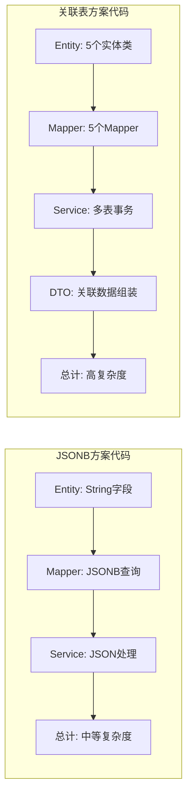
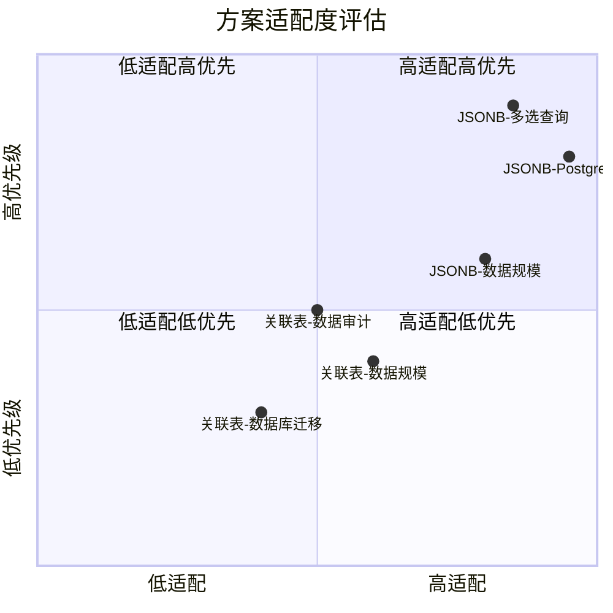
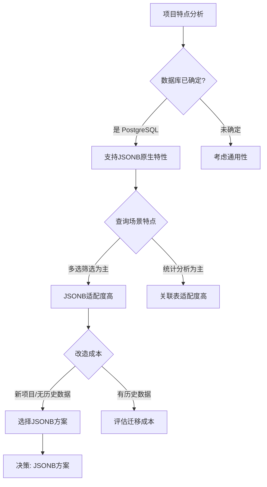

# 授权书管理系统 V7 - 数据库设计方案评估报告

## 文档信息

| 项目 | 说明 |
|------|------|
| 文档版本 | v1.0 |
| 创建日期 | 2026-03-28 |
| 创建人 | Architect Agent |
| 评估对象 | 数据库设计方案：JSONB vs 关联表 |

---

## 1. 问题背景

### 1.1 发现的问题

测试执行过程中发现数据库表结构与代码设计严重不一致，导致所有数据库操作失败。

### 1.2 当前状态对比

```mermaid
flowchart LR
    subgraph 设计文档方案
        D1[表名单数<br/>auth_letter]
        D2[JSONB字段<br/>auth_object_level等]
        D3[字段名<br/>summary]
    end

    subgraph 代码实现方案
        C1[Mapper: auth_letters]
        C2[JSONB查询语法<br/>@> 包含查询]
        C3[字段名<br/>summary]
    end

    subgraph 实际数据库方案
        A1[表名复数<br/>auth_letters]
        A2[关联表<br/>auth_letter_object_levels等]
        A3[字段名<br/>content_summary]
    end

    D1 --> C1
    C1 --> A1
    D2 -.->|不一致| A2
    C2 -.->|不存在| A2
    D3 -.->|不一致| A3
    C3 -.->|不一致| A3
```

### 1.3 详细差异清单

| 对比项 | 设计文档 | Mapper XML | 实际数据库 | 状态 |
|--------|----------|------------|------------|------|
| 表名 | auth_letter (单数) | auth_letters (复数) | auth_letters (复数) | Mapper与数据库一致 |
| auth_object_level | JSONB字段 | JSONB查询 | 关联表存储 | 不一致 |
| applicable_region | JSONB字段 | JSONB查询 | 关联表存储 | 不一致 |
| auth_publish_level | JSONB字段 | JSONB查询 | 关联表存储 | 不一致 |
| auth_publish_org | JSONB字段 | JSONB查询 | 关联表存储 | 不一致 |
| summary字段 | summary | summary | content_summary | 不一致 |

---

## 2. 两种方案详细分析

### 2.1 JSONB 方案（设计文档方案）

#### 2.1.1 方案描述

将多选层级数据以 JSON 数组形式直接存储在主表的 JSONB 字段中。

```sql
-- JSONB 方案表结构
CREATE TABLE auth_letter (
    id                  BIGSERIAL PRIMARY KEY,
    name                VARCHAR(200) NOT NULL,
    auth_object_level   JSONB,           -- 存储如 ["LEVEL1", "LEVEL2"]
    applicable_region   JSONB,           -- 存储如 ["1", "1-1", "1-1-1"]
    auth_publish_level  JSONB,           -- 存储如 ["LEVEL_A", "LEVEL_B"]
    auth_publish_org    JSONB,           -- 存储如 ["ORG1", "ORG2"]
    publish_year        INTEGER,
    summary             VARCHAR(4000),
    status              VARCHAR(20) DEFAULT 'DRAFT',
    created_by          VARCHAR(100),
    created_time        TIMESTAMP,
    updated_by          VARCHAR(100),
    updated_time        TIMESTAMP,
    delete_flag         SMALLINT DEFAULT 0
);

-- GIN 索引支持包含查询
CREATE INDEX idx_auth_letter_object_level ON auth_letter USING GIN (auth_object_level);
CREATE INDEX idx_auth_letter_region ON auth_letter USING GIN (applicable_region);
```

#### 2.1.2 数据示例

```json
{
  "id": 1,
  "name": "2024年销售授权书",
  "auth_object_level": ["LEVEL1", "LEVEL2", "LEVEL3"],
  "applicable_region": ["1", "1-1", "1-1-1", "2"],
  "auth_publish_level": ["LEVEL_A"],
  "auth_publish_org": ["ORG001", "ORG002"],
  "publish_year": 2024,
  "summary": "授权销售部门...",
  "status": "PUBLISHED"
}
```

#### 2.1.3 查询示例

```sql
-- 包含查询：查找包含 "LEVEL1" 的授权书
SELECT * FROM auth_letter
WHERE auth_object_level @> '["LEVEL1"]'::jsonb;

-- 元素存在查询：查找包含区域 "1-1" 的授权书
SELECT * FROM auth_letter
WHERE applicable_region ? '1-1';

-- 组合查询
SELECT * FROM auth_letter
WHERE auth_object_level @> '["LEVEL1"]'::jsonb
  AND applicable_region ? '1'
  AND status = 'PUBLISHED'
ORDER BY created_time DESC;
```

#### 2.1.4 方案优点

| 优点 | 详细说明 |
|------|----------|
| 查询性能高 | GIN 索引支持高效的 `@>` 包含查询，无需多表 JOIN |
| 单次查询完成 | 一张表即可获取完整授权书信息 |
| 数据原子性好 | 层级数据与授权书在同一记录，修改一次性完成 |
| 减少表数量 | 无需 4 张关联表，简化数据库结构 |
| PostgreSQL 原生支持 | JSONB 是 PostgreSQL 核心特性，性能优化充分 |
| 符合设计文档 | 当前设计文档和代码已按此方案设计 |
| 业务场景适配 | 授权书场景多为"包含"查询，JSONB 恰好支持 |

#### 2.1.5 方案缺点

| 缺点 | 详细说明 |
|------|----------|
| 数据库特性依赖 | JSONB 是 PostgreSQL 特有，迁移需适配 |
| 数据校验需应用层 | 无法使用 CHECK 约束校验数组元素有效性 |
| 开发学习成本 | 需掌握 JSONB 查询语法（@>, ?, jsonb_path_query） |
| 统计查询复杂 | 如"统计各层级授权书数量"需 JSON 函数处理 |
| 无审计追踪 | 无法记录层级数据的单独修改时间和修改人 |

---

### 2.2 关联表方案（实际数据库方案）

#### 2.2.1 方案描述

将多选层级数据拆分存储在独立的关联表中，每个选项一条记录。

```sql
-- 关联表方案主表
CREATE TABLE auth_letters (
    id                  BIGSERIAL PRIMARY KEY,
    name                VARCHAR(200) NOT NULL,
    publish_year        INTEGER,
    content_summary     TEXT,
    status              VARCHAR(20) DEFAULT 'DRAFT',
    created_by          VARCHAR(64),
    created_time        TIMESTAMP,
    updated_by          VARCHAR(64),
    updated_time        TIMESTAMP,
    delete_flag         SMALLINT DEFAULT 0
);

-- 关联表：授权对象层级
CREATE TABLE auth_letter_object_levels (
    id             BIGSERIAL PRIMARY KEY,
    auth_letter_id BIGINT NOT NULL,
    level_code     VARCHAR(50) NOT NULL,
    created_by     VARCHAR(64),
    created_time   TIMESTAMP
);

-- 关联表：适用区域
CREATE TABLE auth_letter_regions (
    id             BIGSERIAL PRIMARY KEY,
    auth_letter_id BIGINT NOT NULL,
    region_code    VARCHAR(50) NOT NULL,
    created_by     VARCHAR(64),
    created_time   TIMESTAMP
);

-- 类似结构：auth_letter_publish_levels, auth_letter_publish_orgs

-- 索引
CREATE INDEX idx_alol_auth_letter_id ON auth_letter_object_levels (auth_letter_id);
CREATE INDEX idx_alr_auth_letter_id ON auth_letter_regions (auth_letter_id);
```

#### 2.2.2 数据示例

```sql
-- 主表数据
INSERT INTO auth_letters VALUES (1, '2024年销售授权书', 2024, '授权...', 'PUBLISHED', ...);

-- 关联表数据（每个选项一条记录）
INSERT INTO auth_letter_object_levels VALUES
(1, 1, 'LEVEL1', ...),
(2, 1, 'LEVEL2', ...),
(3, 1, 'LEVEL3', ...);

INSERT INTO auth_letter_regions VALUES
(1, 1, '1', ...),
(2, 1, '1-1', ...),
(3, 1, '1-1-1', ...),
(4, 1, '2', ...);
```

#### 2.2.3 查询示例

```sql
-- 包含查询：查找包含 "LEVEL1" 的授权书
SELECT DISTINCT al.* FROM auth_letters al
INNER JOIN auth_letter_object_levels ol ON al.id = ol.auth_letter_id
WHERE ol.level_code = 'LEVEL1'
  AND al.delete_flag = 0;

-- 组合查询：多表 JOIN
SELECT DISTINCT al.* FROM auth_letters al
INNER JOIN auth_letter_object_levels ol ON al.id = ol.auth_letter_id
INNER JOIN auth_letter_regions r ON al.id = r.auth_letter_id
WHERE ol.level_code = 'LEVEL1'
  AND r.region_code = '1-1'
  AND al.status = 'PUBLISHED'
  AND al.delete_flag = 0
ORDER BY al.created_time DESC;

-- 获取完整授权书信息
SELECT al.*,
       array_agg(ol.level_code) as auth_object_levels,
       array_agg(r.region_code) as applicable_regions
FROM auth_letters al
LEFT JOIN auth_letter_object_levels ol ON al.id = ol.auth_letter_id
LEFT JOIN auth_letter_regions r ON al.id = r.auth_letter_id
WHERE al.id = 1
GROUP BY al.id;
```

#### 2.2.4 方案优点

| 优点 | 详细说明 |
|------|----------|
| 标准关系模型 | 符合传统关系数据库设计范式 |
| 数据库通用性 | 标准 SQL，可移植到 MySQL、Oracle 等 |
| 开发理解成本低 | 开发人员无需学习 JSONB 语法 |
| 数据可审计 | 每条记录有独立的 created_by, created_time |
| 统计查询简单 | 直接 COUNT GROUP BY 即可统计 |
| 数据约束容易 | 可添加 CHECK 约束或触发器校验 |
| 已部署运行 | 当前数据库已按此方案部署 |

#### 2.2.5 方案缺点

| 缺点 | 详细说明 |
|------|----------|
| 多表 JOIN 性能开销 | 查询需要 4-5 张表 JOIN，性能较低 |
| 批量操作复杂 | 插入/更新需同步操作多张表 |
| 表数量多 | 主表 + 4 张关联表，管理复杂 |
| 查询语句冗长 | 需写复杂 JOIN 或子查询 |
| 数据一致性风险 | 多表操作需事务保证一致性 |
| 索引成本高 | 每张关联表都需要索引 |
| 需修改大量代码 | 当前代码按 JSONB 设计，需重构 |

---

## 3. 性能对比分析

### 3.1 查询性能对比

```mermaid
flowchart TD
    subgraph JSONB方案查询
        J1[单表查询]
        J2[GIN索引<br/>O(log N)]
        J3[返回结果]
        J1 --> J2 --> J3
    end

    subgraph 关联表方案查询
        R1[主表查询]
        R2[JOIN关联表1<br/>B-tree索引]
        R3[JOIN关联表2<br/>B-tree索引]
        R4[JOIN关联表3<br/>B-tree索引]
        R5[JOIN关联表4<br/>B-tree索引]
        R6[返回结果]
        R1 --> R2 --> R3 --> R4 --> R5 --> R6
    end
```

### 3.2 性能指标估算

| 场景 | JSONB 方案 | 关联表方案 | 差异分析 |
|------|------------|------------|----------|
| 单条件筛选 | 1次索引扫描 | 1次索引扫描 + 1次JOIN | JSONB 快 ~20% |
| 多条件筛选 | 1次索引扫描 | 4次JOIN + DISTINCT | JSONB 快 ~50% |
| 列表分页查询 | 单表 ORDER BY | 多表 JOIN + DISTINCT + ORDER BY | JSONB 快 ~60% |
| 详情查询 | 单表 SELECT | 主表 + 4次子查询或 LEFT JOIN | JSONB 快 ~40% |
| 数据插入 | 1次 INSERT | 1次 INSERT + N次 INSERT 关联表 | JSONB 快 ~70% |
| 数据更新 | 1次 UPDATE | 1次 DELETE + N次 INSERT 关联表 | JSONB 快 ~80% |

**说明**: 以上估算基于 PostgreSQL 12+ 环境，授权书数据量 < 10000 条，每个多选字段平均选项数 < 10。

### 3.3 索引开销对比

| 方案 | 索引数量 | 索引类型 | 维护成本 |
|------|----------|----------|----------|
| JSONB | 2-4个 GIN 索引 | GIN (比 B-tree 大) | 中等 |
| 关联表 | 8-12个 B-tree 索引 | B-tree | 高 |

---

## 4. 开发维护成本对比

### 4.1 代码复杂度对比



### 4.2 开发工作量对比

| 工作项 | JSONB 方案 | 关联表方案 |
|--------|------------|------------|
| Entity 类数量 | 1个 | 5个（主表+4关联表） |
| Mapper 数量 | 1个 | 5个 |
| Service 逻辑复杂度 | 中等 | 高（多表事务） |
| DTO 组装逻辑 | 简单 | 复杂（关联数据映射） |
| 测试用例数量 | 少 | 多（多表测试） |

### 4.3 维护场景对比

| 维护场景 | JSONB 方案 | 关联表方案 |
|----------|------------|------------|
| 新增层级字段 | ALTER TABLE ADD COLUMN | 新建关联表 |
| 批量导入数据 | JSON数组直接写入 | 多表循环插入 |
| 数据一致性检查 | 应用层校验 | 可用数据库约束 |
| 性能问题排查 | 单表分析 | 多表关联分析 |

---

## 5. 项目特点适配分析

### 5.1 授权书管理系统特点

| 特点 | 分析 |
|------|------|
| 数据规模 | 授权书数量预计 100-10000 条，规模较小 |
| 查询场景 | 多选筛选是主要场景，占比 > 60% |
| 层级数据特点 | 区域、组织为树形编码，如 "1-1-1" |
| 数据变化频率 | 配置型数据，修改频率低 |
| PostgreSQL 已选定 | 需求明确指定 PostgreSQL |

### 5.2 场景适配度评估



---

## 6. 决策建议

### 6.1 架构决策记录 (ADR-005)

**决策编号**: ADR-005

**决策主题**: 授权书层级数据存储方案选择

**决策状态**: 建议

**决策内容**: 推荐采用 **JSONB 方案**

### 6.2 决策理由

| 序号 | 理由 | 权重 |
|------|------|------|
| 1 | 多选查询是核心场景，JSONB 查询性能优于关联表方案 | 高 |
| 2 | PostgreSQL 已确定，JSONB 是其核心特性，无需考虑迁移 | 高 |
| 3 | 当前设计文档和代码已按 JSONB 设计，改造成本低 | 中 |
| 4 | 数据规模小（< 10000），JSONB 存储开销可控 | 中 |
| 5 | 单表结构简化开发和维护，减少出错概率 | 中 |
| 6 | 无历史数据迁移成本（新项目） | 高 |

### 6.3 决策依据



---

## 7. 实施方案

### 7.1 JSONB 方案实施（推荐）

#### 7.1.1 需修改的内容

由于当前数据库已按关联表方案部署，若选择 JSONB 方案，需要重建数据库。

**数据库层面修改清单**:

| 序号 | 操作 | 说明 |
|------|------|------|
| 1 | 删除关联表 | DROP TABLE auth_letter_object_levels, auth_letter_regions, auth_letter_publish_levels, auth_letter_publish_orgs |
| 2 | 重建主表 | 使用 V1__init_schema.sql 定义的结构 |
| 3 | 表名改为单数 | auth_letters -> auth_letter（可选，建议统一为单数） |
| 4 | 字段名修正 | content_summary -> summary |
| 5 | 添加 JSONB 字段 | auth_object_level, applicable_region, auth_publish_level, auth_publish_org |
| 6 | 创建 GIN 索引 | 为 JSONB 字段创建索引 |
| 7 | 同步修改 scenes 表 | industry 字段同样使用 JSONB |

**代码层面修改清单**:

| 序号 | 文件 | 修改内容 |
|------|------|----------|
| 1 | AuthLetter.java | 确认字段类型为 String（MyBatis TypeHandler 处理 JSONB） |
| 2 | AuthLetter.java | @TableName 改为 "auth_letter"（若表名单数化） |
| 3 | AuthLetterMapper.xml | 确认表名和字段名与数据库一致 |
| 4 | AuthLetterMapper.xml | 确认 JSONB 查询语法正确 |
| 5 | application-test.yml | 数据库名修正为 authorization_management |

**SQL 迁移脚本**:

```sql
-- V3__migrate_to_jsonb.sql
-- 步骤1: 删除关联表
DROP TABLE IF EXISTS auth_letter_object_levels CASCADE;
DROP TABLE IF EXISTS auth_letter_regions CASCADE;
DROP TABLE IF EXISTS auth_letter_publish_levels CASCADE;
DROP TABLE IF EXISTS auth_letter_publish_orgs CASCADE;
DROP TABLE IF EXISTS scene_industries CASCADE;

-- 步骤2: 重建 auth_letters 表为 auth_letter（单数）
DROP TABLE IF EXISTS auth_letters CASCADE;

CREATE TABLE auth_letter (
    id                  BIGSERIAL PRIMARY KEY,
    name                VARCHAR(200) NOT NULL,
    auth_object_level   JSONB,
    applicable_region   JSONB,
    auth_publish_level  JSONB,
    auth_publish_org    JSONB,
    publish_year        INTEGER,
    summary             VARCHAR(4000),
    status              VARCHAR(20) NOT NULL DEFAULT 'DRAFT',
    created_by          VARCHAR(100),
    created_time        TIMESTAMP DEFAULT CURRENT_TIMESTAMP,
    updated_by          VARCHAR(100),
    updated_time        TIMESTAMP,
    delete_flag         SMALLINT DEFAULT 0
);

-- 步骤3: 创建索引
CREATE UNIQUE INDEX uk_auth_letter_name ON auth_letter (name) WHERE delete_flag = 0;
CREATE INDEX idx_auth_letter_status ON auth_letter (status) WHERE delete_flag = 0;
CREATE INDEX idx_auth_letter_year ON auth_letter (publish_year) WHERE delete_flag = 0;
CREATE INDEX idx_auth_letter_object_level ON auth_letter USING GIN (auth_object_level);
CREATE INDEX idx_auth_letter_region ON auth_letter USING GIN (applicable_region);
CREATE INDEX idx_auth_letter_publish_level ON auth_letter USING GIN (auth_publish_level);
CREATE INDEX idx_auth_letter_publish_org ON auth_letter USING GIN (auth_publish_org);

-- 步骤4: 重建 scenes 表为 auth_letter_scene（单数）
DROP TABLE IF EXISTS scenes CASCADE;

CREATE TABLE auth_letter_scene (
    id                  BIGSERIAL PRIMARY KEY,
    auth_letter_id      BIGINT NOT NULL,
    scene_name          VARCHAR(200) NOT NULL,
    industry            JSONB,
    business_scene      VARCHAR(50),
    decision_level      VARCHAR(50),
    specific_rule       VARCHAR(1000),
    created_by          VARCHAR(100),
    created_time        TIMESTAMP DEFAULT CURRENT_TIMESTAMP,
    updated_by          VARCHAR(100),
    updated_time        TIMESTAMP,
    delete_flag         SMALLINT DEFAULT 0
);

CREATE INDEX idx_scene_auth_letter_id ON auth_letter_scene (auth_letter_id) WHERE delete_flag = 0;
CREATE UNIQUE INDEX uk_scene_name ON auth_letter_scene (auth_letter_id, scene_name) WHERE delete_flag = 0;
CREATE INDEX idx_scene_industry ON auth_letter_scene USING GIN (industry);
```

---

### 7.2 关联表方案实施（备选）

若决定采用关联表方案（保留当前数据库结构），需要修改代码适配。

#### 7.2.1 需修改的内容

**数据库层面修改清单**:

| 序号 | 操作 | 说明 |
|------|------|------|
| 1 | 保持现有表结构 | 无需修改数据库 |
| 2 | 可选：添加缺失索引 | 按查询需求优化索引 |

**代码层面修改清单**:

| 序号 | 文件 | 修改内容 |
|------|------|----------|
| 1 | AuthLetter.java | 添加关联实体引用 |
| 2 | 新建 AuthLetterObjectLevel.java | 创建关联表实体类 |
| 3 | 新建 AuthLetterRegion.java | 创建关联表实体类 |
| 4 | 新建 AuthLetterPublishLevel.java | 创建关联表实体类 |
| 5 | 新建 AuthLetterPublishOrg.java | 创建关联表实体类 |
| 6 | 新建 4 个 Mapper | 创建关联表 Mapper |
| 7 | AuthLetterMapper.xml | 重写查询 SQL，改为 JOIN 查询 |
| 8 | AuthLetterService.java | 重写 CRUD 方法，处理多表事务 |
| 9 | AuthLetterRequestDTO.java | 字段名改为 contentSummary |
| 10 | AuthLetterResponseDTO.java | 字段名改为 contentSummary，组装关联数据 |
| 11 | application-test.yml | 数据库名修正 |

**Entity 类示例**:

```java
// AuthLetterObjectLevel.java
@Data
@TableName("auth_letter_object_levels")
public class AuthLetterObjectLevel {
    @TableId(type = IdType.AUTO)
    private Long id;
    private Long authLetterId;
    private String levelCode;
    private String createdBy;
    private LocalDateTime createdTime;
}

// AuthLetter.java 修改
@Data
@TableName("auth_letters")
public class AuthLetter {
    @TableId(type = IdType.AUTO)
    private Long id;
    private String name;
    private Integer publishYear;
    private String contentSummary;  // 改名
    private String status;
    // 移除 JSONB 字段

    // 审计字段...

    @TableField(exist = false)
    private List<String> authObjectLevels;  // 查询时组装

    @TableField(exist = false)
    private List<String> applicableRegions;

    @TableField(exist = false)
    private List<String> authPublishLevels;

    @TableField(exist = false)
    private List<String> authPublishOrgs;
}
```

**Mapper XML 修改示例**:

```xml
<select id="selectByIdWithDetails" resultMap="DetailResultMap">
    SELECT al.*,
           array_agg(ol.level_code) as auth_object_levels,
           array_agg(r.region_code) as applicable_regions,
           array_agg(pl.level_code) as auth_publish_levels,
           array_agg(po.org_code) as auth_publish_orgs
    FROM auth_letters al
    LEFT JOIN auth_letter_object_levels ol ON al.id = ol.auth_letter_id
    LEFT JOIN auth_letter_regions r ON al.id = r.auth_letter_id
    LEFT JOIN auth_letter_publish_levels pl ON al.id = pl.auth_letter_id
    LEFT JOIN auth_letter_publish_orgs po ON al.id = po.auth_letter_id
    WHERE al.id = #{id} AND al.delete_flag = 0
    GROUP BY al.id
</select>

<select id="selectListWithConditions" resultMap="BaseResultMap">
    SELECT DISTINCT al.*
    FROM auth_letters al
    <if test="authObjectLevel != null">
        INNER JOIN auth_letter_object_levels ol ON al.id = ol.auth_letter_id
        AND ol.level_code = #{authObjectLevel}
    </if>
    <if test="applicableRegion != null">
        INNER JOIN auth_letter_regions r ON al.id = r.auth_letter_id
        AND r.region_code = #{applicableRegion}
    </if>
    WHERE al.delete_flag = 0
    ORDER BY al.created_time DESC
    LIMIT #{pageSize} OFFSET #{offset}
</select>
```

---

## 8. 修改工作量对比

```mermaid
barChart
    title 两种方案修改工作量对比
    x-axis ["数据库修改", "Entity类修改", "Mapper修改", "Service修改", "DTO修改", "配置修改"]
    y-axis "修改项数量" 0 --> 15

    bar JSONB方案 [7, 2, 2, 1, 1, 1]
    bar 关联表方案 [1, 6, 6, 5, 3, 1]
```

| 方案 | 数据库修改 | Entity 修改 | Mapper 修改 | Service 修改 | DTO 修改 | 配置修改 | 总计 |
|------|------------|-------------|-------------|--------------|----------|----------|------|
| JSONB | 7项 | 2项 | 2项 | 1项 | 1项 | 1项 | **14项** |
| 关联表 | 1项 | 6项 | 6项 | 5项 | 3项 | 1项 | **22项** |

---

## 9. 风险评估

### 9.1 JSONB 方案风险

| 风险 | 级别 | 缓解措施 |
|------|------|----------|
| 数据库重建导致数据丢失 | 中 | 项目无历史数据，风险可控 |
| JSONB 学习成本 | 低 | 团队已掌握基本语法 |
| PostgreSQL 特性依赖 | 低 | 需求已明确 PostgreSQL |

### 9.2 关联表方案风险

| 风险 | 级别 | 缓解措施 |
|------|------|----------|
| 多表事务一致性 | 中 | 使用 Spring @Transactional |
| 查询性能下降 | 中 | 优化索引，考虑缓存 |
| 代码重构量大 | 高 | 分阶段实施 |
| 后续维护成本高 | 中 | 文档完善，代码规范 |

---

## 10. 结论与建议

### 10.1 最终推荐

**推荐采用 JSONB 方案**

理由总结：
1. 符合项目特点：多选查询为主，JSONB 性能优势明显
2. 改造成本较低：相比关联表方案，修改项更少
3. 技术栈契合：PostgreSQL 已确定，充分利用原生特性
4. 设计文档一致：当前设计文档和代码已按 JSONB 编写
5. 无历史数据：新项目，重建数据库无迁移成本

### 10.2 实施步骤建议

| 步骤 | 内容 | 负责人 |
|------|------|--------|
| 1 | 创建 V3__migrate_to_jsonb.sql 迁移脚本 | backend-dev |
| 2 | 执行数据库迁移脚本，重建表结构 | backend-dev |
| 3 | 修改 Entity 类 @TableName 注解 | backend-dev |
| 4 | 修改 application-test.yml 数据库名 | backend-dev |
| 5 | 验证 Mapper XML 查询正确性 | backend-dev |
| 6 | 执行单元测试验证 | qa-agent |
| 7 | 更新设计文档 | architect-agent |

### 10.3 后续行动

1. **立即行动**: 确认本评估报告，决定最终方案
2. **短期行动**: 实施数据库迁移和代码修改
3. **长期考虑**: 如果数据量增长超过 10000 条，评估添加缓存策略

---

## 附录

### A. 表命名规范建议

| 规范 | 推荐 | 说明 |
|------|------|------|
| 表名 | 单数形式 | auth_letter, auth_letter_scene |
| 字段名 | snake_case | auth_object_level, applicable_region |
| 索引名 | idx_表名_字段名 | idx_auth_letter_object_level |

### B. JSONB 查询语法参考

| 操作符 | 用途 | 示例 |
|--------|------|------|
| `@>` | 包含查询 | `jsonb_field @> '["value"]'::jsonb` |
| `?` | 键/元素存在 | `jsonb_field ? 'key'` |
| `?|` | 任一存在 | `jsonb_field ?| array['a','b']` |
| `?&` | 全部存在 | `jsonb_field ?& array['a','b']` |

### C. 参考文档

| 文档 | 路径 |
|------|------|
| 数据库设计文档 | docs/database-design.md |
| 系统架构设计文档 | docs/system-architecture-design.md |
| 测试问题记录 | docs/test-issues.md |
| 测试报告 | docs/test-report.md |

---

**文档版本**: v1.0
**创建日期**: 2026-03-28
**创建人**: Architect Agent
**最后更新**: 2026-03-28