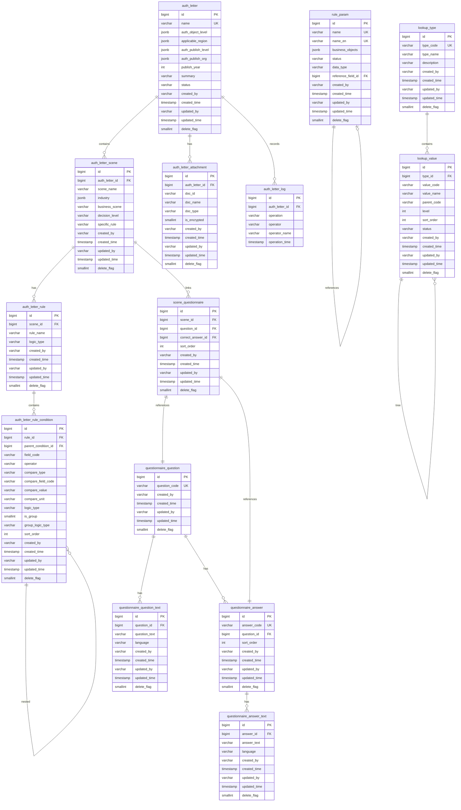

# 授权书管理系统 V7 - 数据库设计文档

## 1. 数据库概述

### 1.1 基本信息

| 项目 | 说明 |
|------|------|
| 数据库类型 | PostgreSQL 12+ |
| 字符集 | UTF-8 |
| 表数量 | 14 |
| 约束策略 | 禁用物理外键，应用层维护关联 |
| 删除策略 | 逻辑删除（delete_flag = 1） |

### 1.2 设计原则

| 原则 | 说明 |
|------|------|
| 无外键约束 | 提高批量操作性能，应用层保证一致性 |
| 逻辑删除 | delete_flag 标记，保留历史数据 |
| JSON 存储 | 多选、树形数据使用 JSONB 类型 |
| 审计字段 | 标准四字段：created_by, created_time, updated_by, updated_time |
| 编码规范 | 表名小写下划线，字段名小写下划线 |

---

## 2. 数据库 ER 图



---

## 3. 表结构详细定义

### 3.1 授权书主表 (auth_letter)

**用途**: 存储授权书基本信息

```sql
CREATE TABLE auth_letter (
    id                  BIGSERIAL PRIMARY KEY,
    name                VARCHAR(200) NOT NULL,
    auth_object_level   JSONB,
    applicable_region   JSONB,
    auth_publish_level  JSONB,
    auth_publish_org    JSONB,
    publish_year        INTEGER,
    summary             VARCHAR(4000),
    status              VARCHAR(20) NOT NULL DEFAULT 'DRAFT',
    created_by          VARCHAR(100),
    created_time        TIMESTAMP DEFAULT CURRENT_TIMESTAMP,
    updated_by          VARCHAR(100),
    updated_time        TIMESTAMP,
    delete_flag         SMALLINT DEFAULT 0
);

-- 唯一约束：授权书名称
CREATE UNIQUE INDEX uk_auth_letter_name ON auth_letter (name) WHERE delete_flag = 0;

-- 索引：状态查询
CREATE INDEX idx_auth_letter_status ON auth_letter (status) WHERE delete_flag = 0;

-- 索引：年份查询
CREATE INDEX idx_auth_letter_year ON auth_letter (publish_year) WHERE delete_flag = 0;

-- GIN 索引：JSONB 包含查询
CREATE INDEX idx_auth_letter_object_level ON auth_letter USING GIN (auth_object_level);
CREATE INDEX idx_auth_letter_region ON auth_letter USING GIN (applicable_region);
```

**字段说明**:

| 字段 | 类型 | 必填 | 说明 |
|------|------|------|------|
| id | BIGSERIAL | 是 | 主键，自增 |
| name | VARCHAR(200) | 是 | 授权书名称，全局唯一 |
| auth_object_level | JSONB | 是 | 授权对象层级，数组格式 |
| applicable_region | JSONB | 是 | 适用区域，数组格式 |
| auth_publish_level | JSONB | 是 | 授权发布层级，数组格式 |
| auth_publish_org | JSONB | 是 | 授权发布组织，数组格式 |
| publish_year | INTEGER | 是 | 发布年份 |
| summary | VARCHAR(4000) | 是 | 内容摘要 |
| status | VARCHAR(20) | 是 | 状态：DRAFT/PUBLISHED/INVALID |
| created_by | VARCHAR(100) | 否 | 创建人 |
| created_time | TIMESTAMP | 否 | 创建时间 |
| updated_by | VARCHAR(100) | 否 | 更新人 |
| updated_time | TIMESTAMP | 否 | 更新时间 |
| delete_flag | SMALLINT | 是 | 删除标记：0-正常，1-删除 |

---

### 3.2 场景表 (auth_letter_scene)

**用途**: 存储授权书的场景配置

```sql
CREATE TABLE auth_letter_scene (
    id                  BIGSERIAL PRIMARY KEY,
    auth_letter_id      BIGINT NOT NULL,
    scene_name          VARCHAR(200) NOT NULL,
    industry            JSONB,
    business_scene      VARCHAR(50),
    decision_level      VARCHAR(50),
    specific_rule       VARCHAR(1000),
    created_by          VARCHAR(100),
    created_time        TIMESTAMP DEFAULT CURRENT_TIMESTAMP,
    updated_by          VARCHAR(100),
    updated_time        TIMESTAMP,
    delete_flag         SMALLINT DEFAULT 0
);

-- 索引：按授权书查询
CREATE INDEX idx_scene_auth_letter_id ON auth_letter_scene (auth_letter_id) WHERE delete_flag = 0;

-- 唯一约束：同一授权书下场景名称唯一
CREATE UNIQUE INDEX uk_scene_name ON auth_letter_scene (auth_letter_id, scene_name) WHERE delete_flag = 0;

-- GIN 索引：产业查询
CREATE INDEX idx_scene_industry ON auth_letter_scene USING GIN (industry);
```

**字段说明**:

| 字段 | 类型 | 必填 | 说明 |
|------|------|------|------|
| id | BIGSERIAL | 是 | 主键 |
| auth_letter_id | BIGINT | 是 | 授权书ID（逻辑关联） |
| scene_name | VARCHAR(200) | 是 | 场景名称，同一授权书下唯一 |
| industry | JSONB | 是 | 产业，树形多选数组 |
| business_scene | VARCHAR(50) | 是 | 业务场景编码 |
| decision_level | VARCHAR(50) | 是 | 决策层级编码 |
| specific_rule | VARCHAR(1000) | 否 | 具体规则描述 |

---

### 3.3 规则组表 (auth_letter_rule)

**用途**: 存储场景的规则组信息

```sql
CREATE TABLE auth_letter_rule (
    id                  BIGSERIAL PRIMARY KEY,
    scene_id            BIGINT NOT NULL,
    rule_name           VARCHAR(200),
    logic_type          VARCHAR(10) DEFAULT 'AND',
    created_by          VARCHAR(100),
    created_time        TIMESTAMP DEFAULT CURRENT_TIMESTAMP,
    updated_by          VARCHAR(100),
    updated_time        TIMESTAMP,
    delete_flag         SMALLINT DEFAULT 0
);

-- 索引：按场景查询
CREATE INDEX idx_rule_scene_id ON auth_letter_rule (scene_id) WHERE delete_flag = 0;
```

**字段说明**:

| 字段 | 类型 | 必填 | 说明 |
|------|------|------|------|
| id | BIGSERIAL | 是 | 主键 |
| scene_id | BIGINT | 是 | 场景ID |
| rule_name | VARCHAR(200) | 否 | 规则名称 |
| logic_type | VARCHAR(10) | 是 | 逻辑类型：AND/OR |

---

### 3.4 规则条件表 (auth_letter_rule_condition)

**用途**: 存储规则的详细条件，支持嵌套

```sql
CREATE TABLE auth_letter_rule_condition (
    id                      BIGSERIAL PRIMARY KEY,
    rule_id                 BIGINT NOT NULL,
    parent_condition_id     BIGINT,
    field_code              VARCHAR(50),
    operator                VARCHAR(10),
    compare_type            VARCHAR(20),
    compare_field_code      VARCHAR(50),
    compare_value           VARCHAR(500),
    compare_unit            VARCHAR(20),
    logic_type              VARCHAR(10) DEFAULT 'AND',
    is_group                SMALLINT DEFAULT 0,
    group_logic_type        VARCHAR(10),
    sort_order              INTEGER DEFAULT 0,
    created_by              VARCHAR(100),
    created_time            TIMESTAMP DEFAULT CURRENT_TIMESTAMP,
    updated_by              VARCHAR(100),
    updated_time            TIMESTAMP,
    delete_flag             SMALLINT DEFAULT 0
);

-- 索引：按规则查询
CREATE INDEX idx_condition_rule_id ON auth_letter_rule_condition (rule_id) WHERE delete_flag = 0;

-- 紧引：查询子条件组
CREATE INDEX idx_condition_parent_id ON auth_letter_rule_condition (parent_condition_id) WHERE delete_flag = 0;
```

**字段说明**:

| 字段 | 类型 | 必填 | 说明 |
|------|------|------|------|
| id | BIGSERIAL | 是 | 主键 |
| rule_id | BIGINT | 是 | 规则组ID |
| parent_condition_id | BIGINT | 否 | 父条件ID，用于嵌套 |
| field_code | VARCHAR(50) | 条件必填 | 规则字段编码 |
| operator | VARCHAR(10) | 条件必填 | 运算符：GT/LT/EQ/GE/LE/NE |
| compare_type | VARCHAR(20) | 条件必填 | 对比类型：FIELD/NUMBER/TEXT/RATIO |
| compare_field_code | VARCHAR(50) | FIELD时必填 | 对比字段编码 |
| compare_value | VARCHAR(500) | NUMBER/TEXT时必填 | 对比值 |
| compare_unit | VARCHAR(20) | 否 | 计量单位 |
| logic_type | VARCHAR(10) | 是 | 与上一条件的连接逻辑 |
| is_group | SMALLINT | 是 | 是否为条件组：0-否，1-是 |
| group_logic_type | VARCHAR(10) | 条件组必填 | 条件组内部逻辑 |
| sort_order | INTEGER | 是 | 排序号 |

---

### 3.5 附件表 (auth_letter_attachment)

**用途**: 存储授权书附件信息

```sql
CREATE TABLE auth_letter_attachment (
    id                  BIGSERIAL PRIMARY KEY,
    auth_letter_id      BIGINT NOT NULL,
    doc_id              VARCHAR(100) NOT NULL,
    doc_name            VARCHAR(200) NOT NULL,
    doc_type            VARCHAR(50),
    is_encrypted        SMALLINT DEFAULT 0,
    created_by          VARCHAR(100),
    created_time        TIMESTAMP DEFAULT CURRENT_TIMESTAMP,
    updated_by          VARCHAR(100),
    updated_time        TIMESTAMP,
    delete_flag         SMALLINT DEFAULT 0
);

-- 索引：按授权书查询
CREATE INDEX idx_attachment_auth_letter_id ON auth_letter_attachment (auth_letter_id) WHERE delete_flag = 0;
```

**字段说明**:

| 字段 | 类型 | 必填 | 说明 |
|------|------|------|------|
| id | BIGSERIAL | 是 | 主键 |
| auth_letter_id | BIGINT | 是 | 授权书ID |
| doc_id | VARCHAR(100) | 是 | 文档ID（文件服务生成） |
| doc_name | VARCHAR(200) | 是 | 文档名称 |
| doc_type | VARCHAR(50) | 是 | 文档类型 |
| is_encrypted | SMALLINT | 否 | 是否加密（暂不实现） |

---

### 3.6 操作日志表 (auth_letter_log)

**用途**: 记录授权书操作历史

```sql
CREATE TABLE auth_letter_log (
    id                  BIGSERIAL PRIMARY KEY,
    auth_letter_id      BIGINT NOT NULL,
    operation           VARCHAR(20) NOT NULL,
    operator            VARCHAR(100),
    operator_name       VARCHAR(200),
    operation_time      TIMESTAMP DEFAULT CURRENT_TIMESTAMP
);

-- 索引：按授权书查询
CREATE INDEX idx_log_auth_letter_id ON auth_letter_log (auth_letter_id);

-- 索引：按时间倒序
CREATE INDEX idx_log_time ON auth_letter_log (operation_time DESC);
```

**字段说明**:

| 字段 | 类型 | 必填 | 说明 |
|------|------|------|------|
| id | BIGSERIAL | 是 | 主键 |
| auth_letter_id | BIGINT | 是 | 授权书ID |
| operation | VARCHAR(20) | 是 | 操作类型：CREATE/UPDATE/PUBLISH/INVALIDATE/DELETE |
| operator | VARCHAR(100) | 否 | 操作人账号 |
| operator_name | VARCHAR(200) | 否 | 操作人姓名 |
| operation_time | TIMESTAMP | 是 | 操作时间 |

---

### 3.7 规则参数表 (rule_param)

**用途**: 存储规则字段元数据

```sql
CREATE TABLE rule_param (
    id                      BIGSERIAL PRIMARY KEY,
    name                    VARCHAR(100) NOT NULL,
    name_en                 VARCHAR(100) NOT NULL,
    business_objects        JSONB,
    status                  VARCHAR(20) DEFAULT 'ACTIVE',
    data_type               VARCHAR(20) NOT NULL,
    reference_field_id      BIGINT,
    created_by              VARCHAR(100),
    created_time            TIMESTAMP DEFAULT CURRENT_TIMESTAMP,
    updated_by              VARCHAR(100),
    updated_time            TIMESTAMP,
    delete_flag             SMALLINT DEFAULT 0
);

-- 唯一约束：名称唯一
CREATE UNIQUE INDEX uk_rule_param_name ON rule_param (name) WHERE delete_flag = 0;

-- 唯一约束：英文名唯一
CREATE UNIQUE INDEX uk_rule_param_name_en ON rule_param (name_en) WHERE delete_flag = 0;

-- 索引：状态查询
CREATE INDEX idx_rule_param_status ON rule_param (status) WHERE delete_flag = 0;
```

**字段说明**:

| 字段 | 类型 | 必填 | 说明 |
|------|------|------|------|
| id | BIGSERIAL | 是 | 主键 |
| name | VARCHAR(100) | 是 | 字段名称，唯一 |
| name_en | VARCHAR(100) | 是 | 英文名称，唯一 |
| business_objects | JSONB | 是 | 业务对象配置数组 |
| status | VARCHAR(20) | 是 | 状态：ACTIVE/INACTIVE |
| data_type | VARCHAR(20) | 是 | 数据类型：TEXT/NUMBER/FIELD/RATIO |
| reference_field_id | BIGINT | 否 | 关联字段ID（FIELD类型时） |

**business_objects 示例**:
```json
[
  {"businessObject": "订单", "valueLogic": "$.order.amount"},
  {"businessObject": "合同", "valueLogic": "$.contract.amount"}
]
```

---

### 3.8 问卷题目表 (questionnaire_question)

**用途**: 存储问卷题目主信息

```sql
CREATE TABLE questionnaire_question (
    id                  BIGSERIAL PRIMARY KEY,
    question_code       VARCHAR(50) NOT NULL,
    created_by          VARCHAR(100),
    created_time        TIMESTAMP DEFAULT CURRENT_TIMESTAMP,
    updated_by          VARCHAR(100),
    updated_time        TIMESTAMP,
    delete_flag         SMALLINT DEFAULT 0
);

-- 唯一约束：题目编号唯一
CREATE UNIQUE INDEX uk_question_code ON questionnaire_question (question_code);
```

**字段说明**:

| 字段 | 类型 | 必填 | 说明 |
|------|------|------|------|
| id | BIGSERIAL | 是 | 主键 |
| question_code | VARCHAR(50) | 是 | 题目编号，自动生成，格式：QT+时间戳 |

---

### 3.9 问卷题目文本表 (questionnaire_question_text)

**用途**: 存储问卷题目多语言内容

```sql
CREATE TABLE questionnaire_question_text (
    id                  BIGSERIAL PRIMARY KEY,
    question_id         BIGINT NOT NULL,
    question_text       VARCHAR(500) NOT NULL,
    language            VARCHAR(10) NOT NULL,
    created_by          VARCHAR(100),
    created_time        TIMESTAMP DEFAULT CURRENT_TIMESTAMP,
    updated_by          VARCHAR(100),
    updated_time        TIMESTAMP,
    delete_flag         SMALLINT DEFAULT 0
);

-- 索引：按题目查询
CREATE INDEX idx_question_text_question_id ON questionnaire_question_text (question_id) WHERE delete_flag = 0;

-- 唯一约束：同一题目同语言唯一
CREATE UNIQUE INDEX uk_question_text_lang ON questionnaire_question_text (question_id, language) WHERE delete_flag = 0;
```

**字段说明**:

| 字段 | 类型 | 必填 | 说明 |
|------|------|------|------|
| id | BIGSERIAL | 是 | 主键 |
| question_id | BIGINT | 是 | 题目ID |
| question_text | VARCHAR(500) | 是 | 题目内容 |
| language | VARCHAR(10) | 是 | 语言：ZH/EN |

---

### 3.10 问卷答案表 (questionnaire_answer)

**用途**: 存储问卷答案主信息

```sql
CREATE TABLE questionnaire_answer (
    id                  BIGSERIAL PRIMARY KEY,
    answer_code         VARCHAR(50) NOT NULL,
    question_id         BIGINT NOT NULL,
    sort_order          INTEGER DEFAULT 0,
    created_by          VARCHAR(100),
    created_time        TIMESTAMP DEFAULT CURRENT_TIMESTAMP,
    updated_by          VARCHAR(100),
    updated_time        TIMESTAMP,
    delete_flag         SMALLINT DEFAULT 0
);

-- 唯一约束：答案编号唯一
CREATE UNIQUE INDEX uk_answer_code ON questionnaire_answer (answer_code);

-- 索引：按题目查询
CREATE INDEX idx_answer_question_id ON questionnaire_answer (question_id) WHERE delete_flag = 0;
```

**字段说明**:

| 字段 | 类型 | 必填 | 说明 |
|------|------|------|------|
| id | BIGSERIAL | 是 | 主键 |
| answer_code | VARCHAR(50) | 是 | 答案编号，自动生成，格式：ANS+时间戳 |
| question_id | BIGINT | 是 | 题目ID |
| sort_order | INTEGER | 是 | 排序号，支持题目排序 |

---

### 3.11 问卷答案文本表 (questionnaire_answer_text)

**用途**: 存储问卷答案多语言内容

```sql
CREATE TABLE questionnaire_answer_text (
    id                  BIGSERIAL PRIMARY KEY,
    answer_id           BIGINT NOT NULL,
    answer_text         VARCHAR(200) NOT NULL,
    language            VARCHAR(10) NOT NULL,
    created_by          VARCHAR(100),
    created_time        TIMESTAMP DEFAULT CURRENT_TIMESTAMP,
    updated_by          VARCHAR(100),
    updated_time        TIMESTAMP,
    delete_flag         SMALLINT DEFAULT 0
);

-- 紧引：按答案查询
CREATE INDEX idx_answer_text_answer_id ON questionnaire_answer_text (answer_id) WHERE delete_flag = 0;

-- 唯一约束：同一答案同语言唯一
CREATE UNIQUE INDEX uk_answer_text_lang ON questionnaire_answer_text (answer_id, language) WHERE delete_flag = 0;
```

**字段说明**:

| 字段 | 类型 | 必填 | 说明 |
|------|------|------|------|
| id | BIGSERIAL | 是 | 主键 |
| answer_id | BIGINT | 是 | 答案ID |
| answer_text | VARCHAR(200) | 是 | 答案内容 |
| language | VARCHAR(10) | 是 | 语言：ZH/EN |

---

### 3.12 场景问卷关联表 (scene_questionnaire)

**用途**: 关联场景与问卷题目

```sql
CREATE TABLE scene_questionnaire (
    id                  BIGSERIAL PRIMARY KEY,
    scene_id            BIGINT NOT NULL,
    question_id         BIGINT NOT NULL,
    correct_answer_id   BIGINT,
    sort_order          INTEGER DEFAULT 0,
    created_by          VARCHAR(100),
    created_time        TIMESTAMP DEFAULT CURRENT_TIMESTAMP,
    updated_by          VARCHAR(100),
    updated_time        TIMESTAMP,
    delete_flag         SMALLINT DEFAULT 0
);

-- 索引：按场景查询
CREATE INDEX idx_scene_q_scene_id ON scene_questionnaire (scene_id) WHERE delete_flag = 0;

-- 紧引：按题目查询（检查题目使用情况）
CREATE INDEX idx_scene_q_question_id ON scene_questionnaire (question_id) WHERE delete_flag = 0;
```

**字段说明**:

| 字段 | 类型 | 必填 | 说明 |
|------|------|------|------|
| id | BIGSERIAL | 是 | 主键 |
| scene_id | BIGINT | 是 | 场景ID |
| question_id | BIGINT | 是 | 题目ID |
| correct_answer_id | BIGINT | 否 | 正确答案ID |
| sort_order | INTEGER | 是 | 排序号 |

---

### 3.13 下拉类型表 (lookup_type)

**用途**: 定义下拉列表类型

```sql
CREATE TABLE lookup_type (
    id                  BIGSERIAL PRIMARY KEY,
    type_code           VARCHAR(50) NOT NULL,
    type_name           VARCHAR(100) NOT NULL,
    description         VARCHAR(500),
    created_by          VARCHAR(100),
    created_time        TIMESTAMP DEFAULT CURRENT_TIMESTAMP,
    updated_by          VARCHAR(100),
    updated_time        TIMESTAMP,
    delete_flag         SMALLINT DEFAULT 0
);

-- 唯一约束：类型编码唯一
CREATE UNIQUE INDEX uk_lookup_type_code ON lookup_type (type_code) WHERE delete_flag = 0;
```

**字段说明**:

| 字段 | 类型 | 必填 | 说明 |
|------|------|------|------|
| id | BIGSERIAL | 是 | 主键 |
| type_code | VARCHAR(50) | 是 | 类型编码，唯一 |
| type_name | VARCHAR(100) | 是 | 类型名称 |
| description | VARCHAR(500) | 否 | 描述 |

---

### 3.14 下拉值表 (lookup_value)

**用途**: 存储下拉列表选项值，支持树形结构

```sql
CREATE TABLE lookup_value (
    id                  BIGSERIAL PRIMARY KEY,
    type_id             BIGINT NOT NULL,
    value_code          VARCHAR(50) NOT NULL,
    value_name          VARCHAR(200) NOT NULL,
    parent_code         VARCHAR(50),
    level               INTEGER DEFAULT 1,
    sort_order          INTEGER DEFAULT 0,
    status              VARCHAR(20) DEFAULT 'ACTIVE',
    created_by          VARCHAR(100),
    created_time        TIMESTAMP DEFAULT CURRENT_TIMESTAMP,
    updated_by          VARCHAR(100),
    updated_time        TIMESTAMP,
    delete_flag         SMALLINT DEFAULT 0
);

-- 紧引：按类型查询
CREATE INDEX idx_lookup_value_type_id ON lookup_value (type_id) WHERE delete_flag = 0;

-- 紧引：树形结构查询
CREATE INDEX idx_lookup_value_parent_code ON lookup_value (parent_code) WHERE delete_flag = 0;

-- 紧引：状态过滤
CREATE INDEX idx_lookup_value_status ON lookup_value (status) WHERE delete_flag = 0;
```

**字段说明**:

| 字段 | 类型 | 必填 | 说明 |
|------|------|------|------|
| id | BIGSERIAL | 是 | 主键 |
| type_id | BIGINT | 是 | 类型ID |
| value_code | VARCHAR(50) | 是 | 值编码 |
| value_name | VARCHAR(200) | 是 | 值名称 |
| parent_code | VARCHAR(50) | 否 | 父节点编码（树形） |
| level | INTEGER | 是 | 层级：1/2/3 |
| sort_order | INTEGER | 是 | 排序号 |
| status | VARCHAR(20) | 是 | 状态：ACTIVE/INACTIVE |

---

## 4. 索引汇总

### 4.1 索引清单

| 表名 | 索引名 | 索引类型 | 字段 | 说明 |
|------|--------|----------|------|------|
| auth_letter | uk_auth_letter_name | UNIQUE | name | 名称唯一 |
| auth_letter | idx_auth_letter_status | BTREE | status | 状态查询 |
| auth_letter | idx_auth_letter_year | BTREE | publish_year | 年份查询 |
| auth_letter | idx_auth_letter_object_level | GIN | auth_object_level | JSONB包含查询 |
| auth_letter | idx_auth_letter_region | GIN | applicable_region | JSONB包含查询 |
| auth_letter_scene | idx_scene_auth_letter_id | BTREE | auth_letter_id | 按授权书查询 |
| auth_letter_scene | uk_scene_name | UNIQUE | auth_letter_id, scene_name | 场景名称唯一 |
| auth_letter_scene | idx_scene_industry | GIN | industry | JSONB包含查询 |
| auth_letter_rule | idx_rule_scene_id | BTREE | scene_id | 按场景查询 |
| auth_letter_rule_condition | idx_condition_rule_id | BTREE | rule_id | 按规则查询 |
| auth_letter_rule_condition | idx_condition_parent_id | BTREE | parent_condition_id | 子条件组查询 |
| auth_letter_attachment | idx_attachment_auth_letter_id | BTREE | auth_letter_id | 按授权书查询 |
| auth_letter_log | idx_log_auth_letter_id | BTREE | auth_letter_id | 按授权书查询 |
| auth_letter_log | idx_log_time | BTREE | operation_time DESC | 时间倒序 |
| rule_param | uk_rule_param_name | UNIQUE | name | 名称唯一 |
| rule_param | uk_rule_param_name_en | UNIQUE | name_en | 英文名唯一 |
| rule_param | idx_rule_param_status | BTREE | status | 状态查询 |
| questionnaire_question | uk_question_code | UNIQUE | question_code | 题目编号唯一 |
| questionnaire_question_text | idx_question_text_question_id | BTREE | question_id | 按题目查询 |
| questionnaire_question_text | uk_question_text_lang | UNIQUE | question_id, language | 同题同语言唯一 |
| questionnaire_answer | uk_answer_code | UNIQUE | answer_code | 答案编号唯一 |
| questionnaire_answer | idx_answer_question_id | BTREE | question_id | 按题目查询 |
| questionnaire_answer_text | idx_answer_text_answer_id | BTREE | answer_id | 按答案查询 |
| questionnaire_answer_text | uk_answer_text_lang | UNIQUE | answer_id, language | 同答同语言唯一 |
| scene_questionnaire | idx_scene_q_scene_id | BTREE | scene_id | 按场景查询 |
| scene_questionnaire | idx_scene_q_question_id | BTREE | question_id | 按题目查询 |
| lookup_type | uk_lookup_type_code | UNIQUE | type_code | 类型编码唯一 |
| lookup_value | idx_lookup_value_type_id | BTREE | type_id | 按类型查询 |
| lookup_value | idx_lookup_value_parent_code | BTREE | parent_code | 树形查询 |
| lookup_value | idx_lookup_value_status | BTREE | status | 状态查询 |

---

## 5. 枚举值定义

### 5.1 授权书状态

| 值 | 说明 |
|------|------|
| DRAFT | 草稿 |
| PUBLISHED | 已发布 |
| INVALID | 已失效 |

### 5.2 规则参数状态

| 值 | 说明 |
|------|------|
| ACTIVE | 生效 |
| INACTIVE | 失效 |

### 5.3 运算符

| 值 | 符号 | 说明 |
|------|------|------|
| GT | > | 大于 |
| LT | < | 小于 |
| EQ | = | 等于 |
| GE | >= | 大于等于 |
| LE | <= | 小于等于 |
| NE | != | 不等于 |

### 5.4 对比类型

| 值 | 说明 |
|------|------|
| FIELD | 对比字段 |
| NUMBER | 数值 |
| TEXT | 文本 |
| RATIO | 比率 |

### 5.5 数据类型

| 值 | 说明 |
|------|------|
| TEXT | 文本 |
| NUMBER | 数值 |
| FIELD | 比对字段 |
| RATIO | 比率 |

### 5.6 逻辑类型

| 值 | 说明 |
|------|------|
| AND | 且 |
| OR | 或 |

### 5.7 语言

| 值 | 说明 |
|------|------|
| ZH | 中文 |
| EN | 英文 |

### 5.8 操作类型

| 值 | 说明 |
|------|------|
| CREATE | 创建 |
| UPDATE | 更新 |
| PUBLISH | 发布 |
| INVALIDATE | 失效 |
| DELETE | 删除 |

---

## 6. 初始化数据

### 6.1 Lookup 类型初始化

```sql
INSERT INTO lookup_type (type_code, type_name, description) VALUES
('AUTH_OBJECT_LEVEL', '授权对象层级', '授权对象层级列表'),
('AUTH_PUBLISH_LEVEL', '授权发布层级', '授权发布层级列表'),
('APPLICABLE_REGION', '适用区域', '适用区域树形列表'),
('AUTH_PUBLISH_ORG', '授权发布组织', '授权发布组织树形列表'),
('INDUSTRY', '产业', '产业树形列表'),
('BUSINESS_SCENE', '业务场景', '业务场景列表'),
('DECISION_LEVEL', '决策层级', '决策层级列表'),
('DOC_TYPE', '文档类型', '文档类型列表'),
('OPERATOR', '运算符', '运算符列表'),
('COMPARE_UNIT', '计量单位', '计量单位列表'),
('LANGUAGE', '语言', '语言列表'),
('DATA_TYPE', '数据类型', '规则参数数据类型');
```

### 6.2 运算符初始化

```sql
INSERT INTO lookup_value (type_id, value_code, value_name, sort_order) VALUES
((SELECT id FROM lookup_type WHERE type_code = 'OPERATOR'), 'GT', '>', 1),
((SELECT id FROM lookup_type WHERE type_code = 'OPERATOR'), 'LT', '<', 2),
((SELECT id FROM lookup_type WHERE type_code = 'OPERATOR'), 'EQ', '=', 3),
((SELECT id FROM lookup_type WHERE type_code = 'OPERATOR'), 'GE', '>=', 4),
((SELECT id FROM lookup_type WHERE type_code = 'OPERATOR'), 'LE', '<=', 5),
((SELECT id FROM lookup_type WHERE type_code = 'OPERATOR'), 'NE', '!=', 6);
```

### 6.3 语言初始化

```sql
INSERT INTO lookup_value (type_id, value_code, value_name, sort_order) VALUES
((SELECT id FROM lookup_type WHERE type_code = 'LANGUAGE'), 'ZH', '中文', 1),
((SELECT id FROM lookup_type WHERE type_code = 'LANGUAGE'), 'EN', '英文', 2);
```

### 6.4 数据类型初始化

```sql
INSERT INTO lookup_value (type_id, value_code, value_name, sort_order) VALUES
((SELECT id FROM lookup_type WHERE type_code = 'DATA_TYPE'), 'TEXT', '文本', 1),
((SELECT id FROM lookup_type WHERE type_code = 'DATA_TYPE'), 'NUMBER', '数值', 2),
((SELECT id FROM lookup_type WHERE type_code = 'DATA_TYPE'), 'FIELD', '比对字段', 3),
((SELECT id FROM lookup_type WHERE type_code = 'DATA_TYPE'), 'RATIO', '比率', 4);
```

### 6.5 计量单位初始化

```sql
INSERT INTO lookup_value (type_id, value_code, value_name, sort_order) VALUES
((SELECT id FROM lookup_type WHERE type_code = 'COMPARE_UNIT'), 'CNY', '人民币（万）', 1),
((SELECT id FROM lookup_type WHERE type_code = 'COMPARE_UNIT'), 'USD', '美元（万）', 2),
((SELECT id FROM lookup_type WHERE type_code = 'COMPARE_UNIT'), 'WAN', '万', 3),
((SELECT id FROM lookup_type WHERE type_code = 'COMPARE_UNIT'), 'ZHAO', '兆', 4);
```

---

## 7. 查询优化示例

### 7.1 授权书列表查询（JSONB 包含）

```sql
SELECT * FROM auth_letter
WHERE delete_flag = 0
  AND status = 'DRAFT'
  AND auth_object_level @> '["LEVEL1"]'::jsonb
  AND publish_year = 2024
ORDER BY created_time DESC
LIMIT 10 OFFSET 0;
```

### 7.2 树形下拉数据查询（递归）

```sql
WITH RECURSIVE tree AS (
    SELECT id, type_id, value_code, value_name, parent_code, level, sort_order
    FROM lookup_value
    WHERE type_id = (SELECT id FROM lookup_type WHERE type_code = 'APPLICABLE_REGION')
      AND parent_code IS NULL
      AND delete_flag = 0

    UNION ALL

    SELECT lv.id, lv.type_id, lv.value_code, lv.value_name, lv.parent_code, lv.level, lv.sort_order
    FROM lookup_value lv
    INNER JOIN tree t ON lv.parent_code = t.value_code
    WHERE lv.delete_flag = 0
)
SELECT * FROM tree ORDER BY level, sort_order;
```

### 7.3 嵌套条件组查询（递归）

```sql
WITH RECURSIVE conditions AS (
    SELECT id, rule_id, parent_condition_id, field_code, operator, compare_type,
           compare_value, logic_type, is_group, group_logic_type, sort_order, 1 as depth
    FROM auth_letter_rule_condition
    WHERE rule_id = 1 AND parent_condition_id IS NULL AND delete_flag = 0

    UNION ALL

    SELECT c.id, c.rule_id, c.parent_condition_id, c.field_code, c.operator, c.compare_type,
           c.compare_value, c.logic_type, c.is_group, c.group_logic_type, c.sort_order, cond.depth + 1
    FROM auth_letter_rule_condition c
    INNER JOIN conditions cond ON c.parent_condition_id = cond.id
    WHERE c.delete_flag = 0
)
SELECT * FROM conditions ORDER BY depth, sort_order;
```

---

## 8. 数据迁移策略

### 8.1 版本控制

所有表变更需通过版本化 SQL 脚本管理：

```
backend/src/main/resources/db/
├── V1__init_schema.sql          # 初始化表结构
├── V2__init_lookup_data.sql     # 初始化下拉数据
├── V3__add_question_sort.sql    # 新增题目排序字段
└── ...
```

### 8.2 变更规范

| 变更类型 | 规范 |
|----------|------|
| 新增表 | 编写新版本脚本 |
| 新增字段 | 使用 `ALTER TABLE ADD COLUMN`，设置默认值 |
| 修改字段 | 不允许，需新增字段并迁移数据 |
| 删除字段 | 不物理删除，标记废弃 |
| 索引变更 | 单独脚本，注明影响范围 |

---

**文档版本**: v1.0
**创建日期**: 2026-03-28
**创建人**: Architect Agent
**最后更新**: 2026-03-28