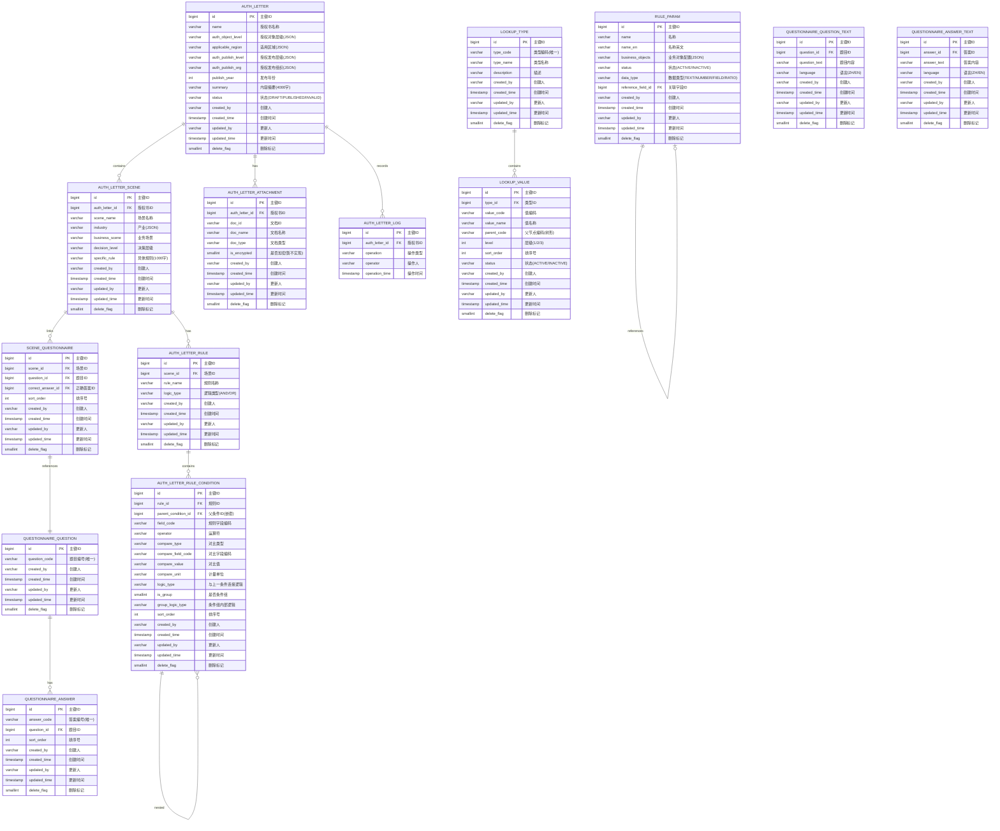
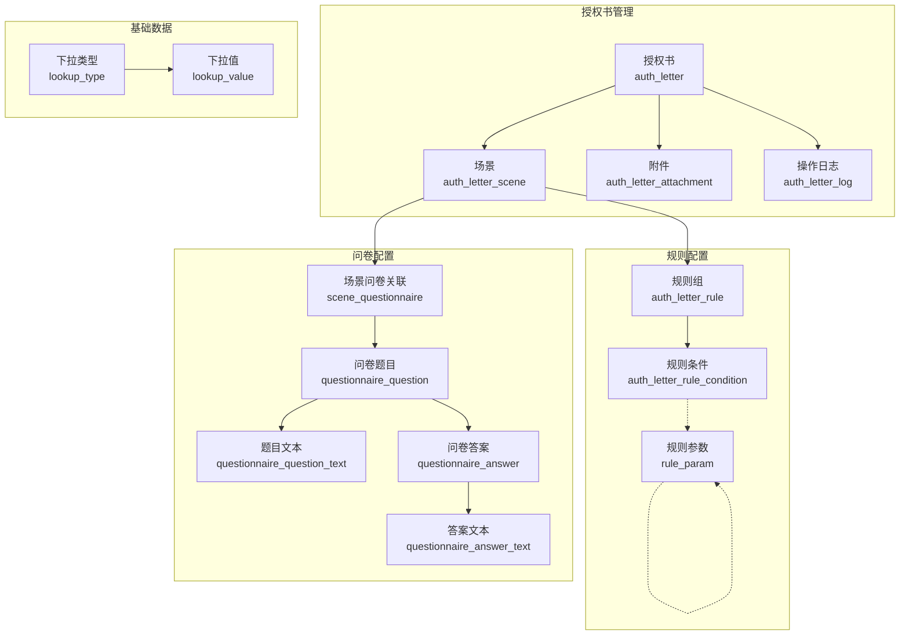

# 授权书管理系统 V7 - 实体关系图

## 1. 概述

本文档描述授权书管理系统的核心实体及其关系。系统采用 PostgreSQL 数据库，遵循以下原则：
- 禁止外键约束，通过应用层维护关联关系
- 所有表包含标准审计字段（created_by, created_time, updated_by, updated_time）
- 使用逻辑删除（delete_flag）

---

## 2. ER 图



---

## 3. 实体关系说明

### 3.1 核心关系

| 关系 | 类型 | 说明 |
|------|------|------|
| AUTH_LETTER → AUTH_LETTER_SCENE | 1:N | 一个授权书包含多个场景 |
| AUTH_LETTER → AUTH_LETTER_ATTACHMENT | 1:N | 一个授权书有多个附件 |
| AUTH_LETTER → AUTH_LETTER_LOG | 1:N | 一个授权书有多条操作日志 |
| AUTH_LETTER_SCENE → AUTH_LETTER_RULE | 1:N | 一个场景有多个规则组 |
| AUTH_LETTER_RULE → AUTH_LETTER_RULE_CONDITION | 1:N | 一个规则组有多个条件 |
| AUTH_LETTER_RULE_CONDITION → AUTH_LETTER_RULE_CONDITION | 1:N | 条件可嵌套（子条件组） |
| AUTH_LETTER_SCENE → SCENE_QUESTIONNAIRE | 1:N | 一个场景关联多个问卷题目 |
| QUESTIONNAIRE_QUESTION → QUESTIONNAIRE_ANSWER | 1:N | 一个题目有多个可选答案 |

### 3.2 多语言支持

| 实体 | 多语言表 | 说明 |
|------|----------|------|
| QUESTIONNAIRE_QUESTION | QUESTIONNAIRE_QUESTION_TEXT | 题目内容支持多语言 |
| QUESTIONNAIRE_ANSWER | QUESTIONNAIRE_ANSWER_TEXT | 答案内容支持多语言 |

### 3.3 自引用关系

| 实体 | 自引用字段 | 说明 |
|------|------------|------|
| AUTH_LETTER_RULE_CONDITION | parent_condition_id | 条件组嵌套结构 |
| RULE_PARAM | reference_field_id | 数据类型为"比对字段"时引用其他字段 |
| LOOKUP_VALUE | parent_code | 树形结构的层级关系 |

---

## 4. 实体详细说明

### 4.1 授权书主表 (auth_letter)

**用途**: 存储授权书的基本信息

**关键字段说明**:
- `auth_object_level`: JSON数组格式存储多选值
- `applicable_region`: JSON数组格式存储树形多选值（如：`["1", "1-1", "1-1-1"]`）
- `status`: 状态枚举值（DRAFT-草稿, PUBLISHED-已发布, INVALID-已失效）

**业务约束**:
- 授权书名称不能重复
- 草稿状态可编辑，已发布/已失效状态不可编辑

---

### 4.2 场景表 (auth_letter_scene)

**用途**: 存储授权书的场景配置

**关键字段说明**:
- `industry`: JSON数组格式存储树形多选值
- `business_scene`: 单选，存储业务场景编码
- `decision_level`: 单选，存储决策层级编码

**业务约束**:
- 场景名称在同一授权书下不能重复
- 每个场景必须配置规则或问卷（至少一项）

---

### 4.3 规则表 (auth_letter_rule)

**用途**: 存储场景的规则组信息

**关键字段说明**:
- `logic_type`: 规则组内条件的连接逻辑（AND-且, OR-或）

---

### 4.4 规则条件表 (auth_letter_rule_condition)

**用途**: 存储规则的详细条件配置

**关键字段说明**:
- `parent_condition_id`: 用于条件组嵌套，指向父条件组
- `field_code`: 规则字段编码，来自规则参数配置
- `operator`: 运算符（>, <, =, >=, <=, !=）
- `compare_type`: 对比类型（FIELD-对比字段, NUMBER-数值, TEXT-文本, RATIO-比例）
- `compare_field_code`: 当 compare_type=FIELD 时使用
- `is_group`: 标识是否为条件组
- `group_logic_type`: 条件组内部的条件连接逻辑

---

### 4.5 附件表 (auth_letter_attachment)

**用途**: 存储授权书的附件信息

**关键字段说明**:
- `doc_id`: 文档ID，由文件上传服务生成（暂不实现上传逻辑）
- `is_encrypted`: 加密标识（暂不实现，灰色禁用）

---

### 4.6 操作日志表 (auth_letter_log)

**用途**: 记录授权书的操作历史

**关键字段说明**:
- `operation`: 操作类型（CREATE-创建, UPDATE-更新, PUBLISH-发布, INVALID-失效, DELETE-删除）

---

### 4.7 规则参数表 (rule_param)

**用途**: 存储规则字段的元数据配置

**关键字段说明**:
- `business_objects`: JSON数组格式存储多个业务对象配置
  ```json
  [
    {"businessObject": "订单", "valueLogic": "$.order.amount"},
    {"businessObject": "合同", "valueLogic": "$.contract.amount"}
  ]
  ```
- `value_logic`: 取值逻辑，JSONPath表达式，告诉规则从调用方传参里取值的位置
- `data_type`: 数据类型（TEXT-文本, NUMBER-数值, FIELD-比对字段, RATIO-比率）
- `reference_field_id`: 当 data_type=FIELD 时，指向关联的规则参数

---

### 4.8 问卷题目表 (questionnaire_question)

**用途**: 存储问卷题目的主信息

**关键字段说明**:
- `question_code`: 题目编号，自动生成，格式：QT + 时间戳

---

### 4.9 问卷题目文本表 (questionnaire_question_text)

**用途**: 存储问卷题目的多语言内容

**关键字段说明**:
- `question_text`: 题目内容，最大500字符
- `language`: 语言代码（ZH-中文, EN-英文）

**业务约束**:
- 同一题目下，相同语言只能有一条记录

---

### 4.10 问卷答案表 (questionnaire_answer)

**用途**: 存储问卷答案的主信息

**关键字段说明**:
- `answer_code`: 答案编号，自动生成，格式：ANS + 时间戳
- `sort_order`: 答案排序号

---

### 4.11 问卷答案文本表 (questionnaire_answer_text)

**用途**: 存储问卷答案的多语言内容

**关键字段说明**:
- `answer_text`: 答案内容，最大200字符
- `language`: 语言代码（ZH-中文, EN-英文）

**业务约束**:
- 同一答案下，相同语言只能有一条记录

---

### 4.12 场景问卷关联表 (scene_questionnaire)

**用途**: 存储场景与问卷题目的关联关系

**关键字段说明**:
- `scene_id`: 场景ID
- `question_id`: 题目ID
- `correct_answer_id`: 正确答案ID
- `sort_order`: 题目排序号（支持问卷题目排序）

---

### 4.13 下拉类型表 (lookup_type)

**用途**: 存储下拉列表的类型定义

**关键字段说明**:
- `type_code`: 类型编码，唯一标识

---

### 4.14 下拉值表 (lookup_value)

**用途**: 存储下拉列表的值定义

**关键字段说明**:
- `parent_code`: 父节点编码，用于树形结构
- `level`: 层级（1-一级, 2-二级, 3-三级, 4-四级）

---

## 5. 数据存储格式说明

### 5.1 JSON格式字段

| 字段 | 存储格式 | 示例 |
|------|----------|------|
| auth_object_level | JSON数组 | `["COMPANY", "BU"]` |
| applicable_region | JSON数组 | `["1", "1-1", "1-1-1", "1-1-1-1"]` |
| auth_publish_level | JSON数组 | `["COMPANY"]` |
| auth_publish_org | JSON数组 | `["1", "1-1"]` |
| industry | JSON数组 | `["LV1", "LV1-LV2"]` |
| business_objects | JSON数组 | `[{"businessObject":"订单","valueLogic":"$.order.amount"}]` |

### 5.2 枚举值定义

| 字段 | 枚举值 |
|------|--------|
| status (授权书) | DRAFT, PUBLISHED, INVALID |
| status (规则参数) | ACTIVE, INACTIVE |
| status (下拉值) | ACTIVE, INACTIVE |
| logic_type | AND, OR |
| operator | GT (>), LT (<), EQ (=), GE (>=), LE (<=), NE (!=) |
| compare_type | FIELD, NUMBER, TEXT, RATIO |
| data_type | TEXT, NUMBER, FIELD, RATIO |
| language | ZH, EN |
| operation (日志) | CREATE, UPDATE, PUBLISH, INVALIDATE, DELETE |
| 层级值 | COMPANY(公司), BU(BU), MKT_SRV(营销服), REGION(地区部), REP_OFFICE(代表处) |

---

## 6. 索引设计建议

| 表名 | 索引名 | 索引字段 | 说明 |
|------|--------|----------|------|
| auth_letter | idx_auth_letter_name | name | 按名称查询 |
| auth_letter | idx_auth_letter_status | status | 按状态查询 |
| auth_letter | idx_auth_letter_publish_year | publish_year | 按年份查询 |
| auth_letter_scene | idx_scene_auth_letter_id | auth_letter_id | 按授权书查询场景 |
| auth_letter_rule | idx_rule_scene_id | scene_id | 按场景查询规则 |
| auth_letter_rule_condition | idx_condition_rule_id | rule_id | 按规则查询条件 |
| auth_letter_rule_condition | idx_condition_parent_id | parent_condition_id | 查询子条件组 |
| auth_letter_attachment | idx_attachment_auth_letter_id | auth_letter_id | 按授权书查询附件 |
| auth_letter_log | idx_log_auth_letter_id | auth_letter_id | 按授权书查询日志 |
| rule_param | idx_rule_param_name | name | 按名称查询 |
| rule_param | idx_rule_param_name_en | name_en | 按英文名查询 |
| questionnaire_question | uk_question_code | question_code | 题目编号唯一 |
| questionnaire_answer | uk_answer_code | answer_code | 答案编号唯一 |
| lookup_type | uk_lookup_type_code | type_code | 类型编码唯一 |
| lookup_value | idx_lookup_value_type_id | type_id | 按类型查询 |
| lookup_value | idx_lookup_value_parent_code | parent_code | 树形结构查询 |

---

## 7. 实体关系图简化版（核心业务）



---

**文档版本**: v1.1
**创建日期**: 2026-03-28
**创建人**: BA Agent
**最后更新**: 2026-03-28
**更新说明**: 根据用户澄清内容更新层级枚举值、场景问卷关联表排序字段等