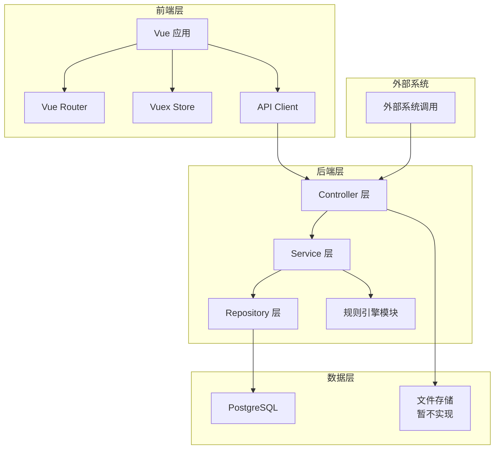
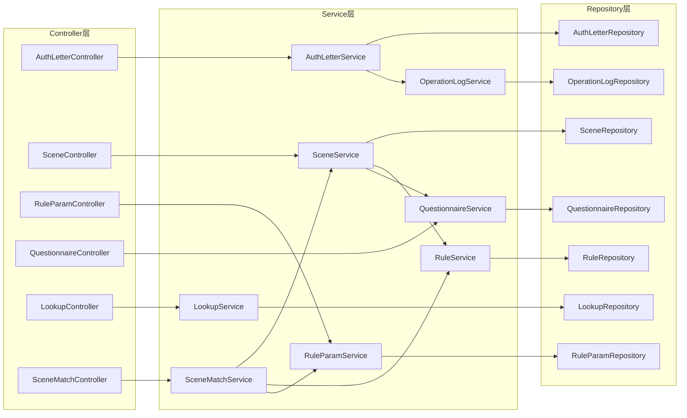
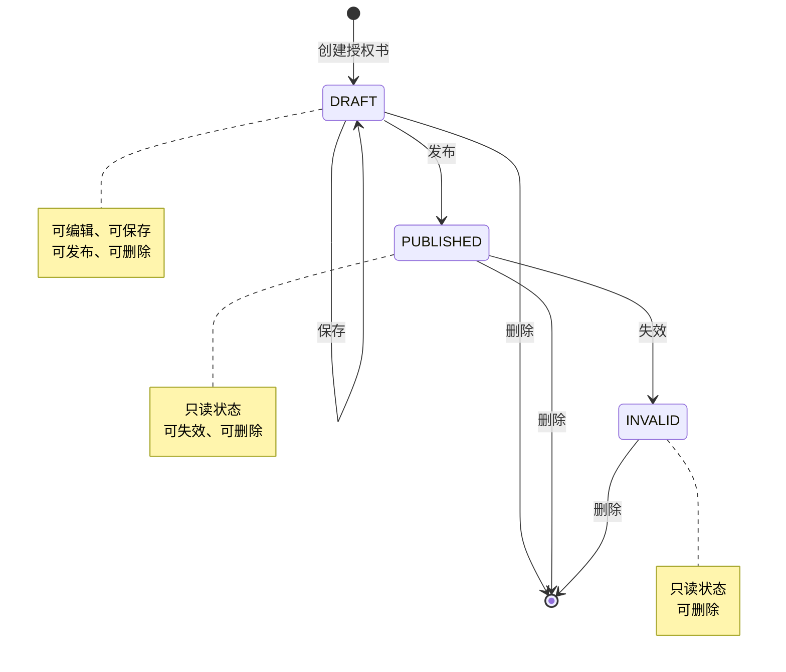
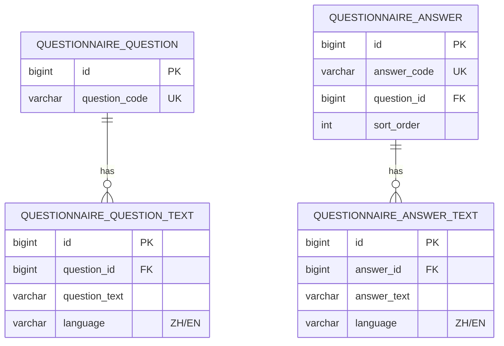
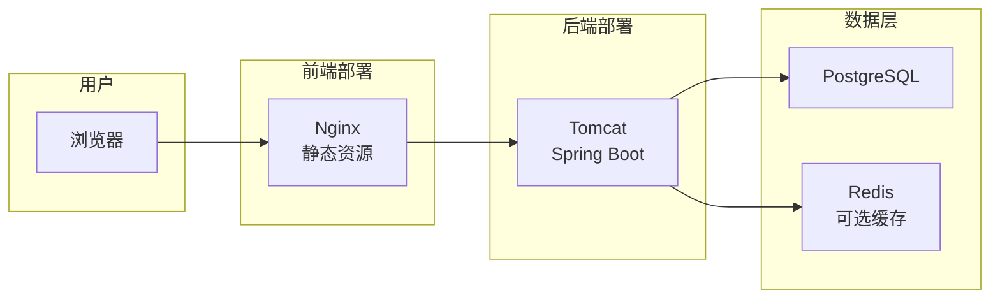
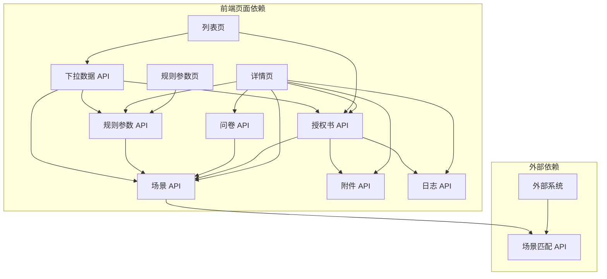

# 授权书管理系统 V7 - 系统架构设计文档

## 1. 架构概述

### 1.1 系统定位

授权书管理系统是一个企业级业务规则配置与场景匹配平台，主要功能包括：
- 授权书生命周期管理（创建、编辑、发布、失效、删除）
- 场景规则配置（支持嵌套条件组）
- 问卷题目多语言管理
- 场景匹配服务（供外部系统调用）

### 1.2 设计原则

| 原则 | 说明 |
|------|------|
| 分层解耦 | 前后端分离，后端采用经典三层架构 |
| 无外键约束 | 应用层维护数据关联，提升扩展性 |
| 逻辑删除 | 数据软删除，保留历史追溯能力 |
| 多语言支持 | 问卷系统支持中英文国际化 |
| 可扩展规则引擎 | 支持嵌套条件组，无层级限制 |

---

## 2. 技术选型

### 2.1 技术栈决策记录

#### ADR-001: 前端技术选型

**状态**: 已采纳

**决策**: 采用 Vue 2.x + Element UI

**理由**:
- 企业级后台管理系统标准方案
- Element UI 提供丰富的表格、表单、树形组件
- 团队熟悉度高，降低开发风险

**替代方案**:
- Vue 3 + Ant Design Vue（需额外学习成本）
- React + Ant Design（技术栈不统一）

---

#### ADR-002: 后端技术选型

**状态**: 已采纳

**决策**: 采用 Java 8 + Spring Boot 2.x + MyBatis

**理由**:
- JDK 8 是企业主流版本，稳定可靠
- Spring Boot 提供快速开发能力
- MyBatis 灵活处理复杂 SQL 查询（规则匹配场景）

**替代方案**:
- Spring Data JPA（规则条件嵌套查询复杂）
- JDK 11/17（部分企业环境不支持）

---

#### ADR-003: 数据库选型

**状态**: 已采纳

**决策**: 采用 PostgreSQL 12+

**理由**:
- 需求文档明确指定 PostgreSQL
- JSON 类型原生支持（层级数据、业务对象配置）
- 递归查询能力强（树形结构、条件组嵌套）

**关键特性使用**:
- `JSONB` 类型存储多选层级数据
- `WITH RECURSIVE` 处理树形下拉数据
- 递归查询处理嵌套条件组

---

#### ADR-004: 规则引擎设计

**状态**: 已采纳

**决策**: 自研轻量级规则引擎，不引入第三方规则引擎

**理由**:
- 规则场景相对固定，不需要复杂 DSL
- 条件组嵌套逻辑可控
- 避免引入 Drools 等重型框架的维护成本

**实现方式**:
- 递归树结构存储条件组
- 内存解析 + 动态表达式计算

---

## 3. 系统架构图

### 3.1 整体架构



### 3.2 后端分层架构



---

## 4. 模块划分

### 4.1 前端模块结构

```
frontend/
├── src/
│   ├── views/                    # 页面组件
│   │   ├── AuthLetterList.vue    # 授权书列表页
│   │   ├── AuthLetterDetail.vue  # 授权书详情页
│   │   └── RuleParamConfig.vue   # 规则参数配置页
│   ├── components/               # 公共组件
│   │   ├── TreeSelect.vue        # 树形多选组件
│   │   ├── RuleCondition.vue     # 规则条件配置组件
│   │   ├── QuestionnaireConfig.vue # 问卷配置组件
│   │   └── LogPanel.vue          # 日志面板组件
│   ├── api/                      # API 调用
│   │   ├── authLetter.js         # 授权书 API
│   │   ├── scene.js              # 场景 API
│   │   ├── ruleParam.js          # 规则参数 API
│   │   ├── questionnaire.js      # 问卷 API
│   │   └── lookup.js             # 下拉数据 API
│   ├── store/                    # Vuex 状态管理
│   │   ├── modules/
│   │   │   ├── authLetter.js
│   │   │   └── lookup.js
│   ├── router/                   # 路由配置
│   │   └── index.js
│   └── utils/                    # 工具函数
│       ├── request.js            # Axios 封装
│       └── validate.js           # 校验规则
```

### 4.2 后端模块结构

```
backend/
├── src/main/java/com/example/auth/
│   ├── controller/               # Controller 层
│   │   ├── AuthLetterController.java
│   │   ├── SceneController.java
│   │   ├── RuleParamController.java
│   │   ├── QuestionnaireController.java
│   │   ├── LookupController.java
│   │   ├── AttachmentController.java
│   │   └── SceneMatchController.java
│   ├── service/                  # Service 层
│   │   ├── AuthLetterService.java
│   │   ├── SceneService.java
│   │   ├── RuleService.java
│   │   ├── RuleParamService.java
│   │   ├── QuestionnaireService.java
│   │   ├── LookupService.java
│   │   ├── AttachmentService.java
│   │   ├── SceneMatchService.java
│   │   ├── OperationLogService.java
│   │   └── impl/                 # Service 实现
│   ├── repository/               # Repository 层
│   │   ├── AuthLetterRepository.java
│   │   ├── SceneRepository.java
│   │   ├── RuleRepository.java
│   │   ├── RuleParamRepository.java
│   │   ├── QuestionnaireRepository.java
│   │   ├── LookupRepository.java
│   │   ├── AttachmentRepository.java
│   │   └── OperationLogRepository.java
│   ├── entity/                   # 实体类
│   │   ├── AuthLetter.java
│   │   ├── AuthLetterScene.java
│   │   ├── AuthLetterRule.java
│   │   ├── AuthLetterRuleCondition.java
│   │   ├── RuleParam.java
│   │   ├── QuestionnaireQuestion.java
│   │   ├── QuestionnaireAnswer.java
│   │   ├── SceneQuestionnaire.java
│   │   ├── LookupType.java
│   │   ├── LookupValue.java
│   │   └── OperationLog.java
│   ├── dto/                      # 数据传输对象
│   │   ├── request/              # 请求 DTO
│   │   └── response/             # 响应 DTO
│   ├── vo/                       # 视图对象
│   ├── enums/                    # 枚举类
│   │   ├── AuthLetterStatus.java
│   │   ├── RuleParamStatus.java
│   │   ├── OperatorType.java
│   │   ├── CompareType.java
│   │   ├── DataType.java
│   │   ├── LogicType.java
│   │   └── OperationType.java
│   ├── exception/                # 异常处理
│   │   ├── BusinessException.java
│   │   ├── GlobalExceptionHandler.java
│   │   └── ErrorCode.java
│   ├── config/                   # 配置类
│   │   ├── MyBatisConfig.java
│   │   ├── SwaggerConfig.java
│   │   └── WebConfig.java
│   └── util/                     # 工具类
│       ├── JsonPathUtil.java     # JSONPath 解析
│       ├── CodeGenerator.java    # 编号生成器
│       └── RuleEvaluator.java    # 规则计算器
├── src/main/resources/
│   ├── mapper/                   # MyBatis Mapper XML
│   ├── application.yml           # 应用配置
│   └── init-data.sql             # 初始化数据
```

---

## 5. 核心流程设计

### 5.1 授权书状态流转



### 5.2 场景匹配流程

```mermaid
flowchart TD
    Start[外部系统调用] --> Input[接收匹配请求]
    Input --> LoadAL[加载授权书场景列表]
    LoadAL --> LoadRules[加载每个场景的规则配置]
    LoadRules --> LoadParams[加载规则参数元数据]
    LoadParams --> ParseData[解析传入数据]
    ParseData --> Iterate[遍历场景列表]

    Iterate --> CheckRule{场景有规则?}
    CheckRule --> YesRule[执行规则匹配]
    CheckRule --> NoRule[跳过规则检查]

    YesRule --> RuleResult{规则命中?}
    RuleResult --> HitRule[记录场景命中]
    RuleResult --> MissRule[场景未命中]

    CheckQuestion{场景有问卷?}
    NoRule --> CheckQuestion
    MissRule --> CheckQuestion
    HitRule --> CheckQuestion

    CheckQuestion --> YesQuestion[问卷匹配<br/>返回给调用方决策]
    CheckQuestion --> NoQuestion[无问卷]
    YesQuestion --> RecordHit[记录命中场景]
    NoQuestion --> RecordHit

    RecordHit --> NextScene{还有场景?}
    NextScene --> YesNext: 是
    YesNext --> Iterate
    NextScene --> NoNext: 否
    NoNext --> Return[返回命中场景列表]
    Return --> End[结束]
```

### 5.3 规则条件嵌套处理

```mermaid
flowchart TD
    Root[根条件组] --> Condition1[条件1]
    Root --> Condition2[条件2]
    Root --> SubGroup1[子条件组1]

    Condition1 --> Eval1[计算条件1]
    Condition2 --> Eval2[计算条件2]

    SubGroup1 --> LogicOR[OR 逻辑]
    LogicOR --> SubCond1[子条件A]
    LogicOR --> SubCond2[子条件B]

    SubCond1 --> EvalA[计算子条件A]
    SubCond2 --> EvalB[计算子条件B]

    EvalA --> ResultA{结果A}
    EvalB --> ResultB{结果B}
    ResultA --> TrueA: true
    ResultA --> FalseA: false
    ResultB --> TrueB: true
    ResultB --> FalseB: false

    TrueA --> SubGroupTrue[子组命中<br/>OR只需一个true]
    TrueB --> SubGroupTrue
    FalseA --> CheckBoth{都false?}
    FalseB --> CheckBoth
    CheckBoth --> SubGroupFalse: 是
    CheckBoth --> SubGroupTrue: 否
    SubGroupFalse --> RootFalse[根组未命中]
    SubGroupTrue --> RootEval[根组 AND 计算]

    Eval1 --> R1{结果1}
    Eval2 --> R2{结果2}
    R1 --> RootEval
    R2 --> RootEval
    RootEval --> FinalResult{最终结果}
    FinalResult --> Hit: 命中
    FinalResult --> Miss: 未命中
```

---

## 6. 关键设计决策

### 6.1 JSON 数据存储策略

| 字段 | 存储类型 | 示例 | PostgreSQL 处理 |
|------|----------|------|-----------------|
| auth_object_level | JSONB | `["LEVEL1","LEVEL2"]` | `@>` 包含查询 |
| applicable_region | JSONB | `["1","1-1","1-1-1"]` | 数组元素遍历 |
| industry | JSONB | `["LV1","LV1-LV2"]` | 树形编码匹配 |
| business_objects | JSONB | `[{"obj":"订单","logic":"$.amount"}]` | JSONPath 解析 |

### 6.2 规则引擎核心算法

**伪代码**:
```
function evaluateRuleGroup(conditions, inputData):
    result = true
    prevLogic = "AND"

    for condition in conditions:
        if condition.isGroup:
            // 递归处理子条件组
            groupResult = evaluateRuleGroup(condition.children, inputData)
            currentResult = groupResult
        else:
            // 单条件计算
            fieldCode = condition.fieldCode
            operator = condition.operator
            compareType = condition.compareType
            compareValue = condition.compareValue

            fieldValue = getFieldValue(fieldCode, inputData)
            currentResult = evaluate(fieldValue, operator, compareType, compareValue)

        // 逻辑连接
        if prevLogic == "AND":
            result = result AND currentResult
        else:
            result = result OR currentResult

        prevLogic = condition.logicType

    return result
```

### 6.3 多语言处理策略

**问卷多语言表结构**:


**查询策略**:
- 前端传入 `language` 参数
- Service 层按语言过滤文本表
- 同一题目/答案下，同语言仅一条记录

---

## 7. 性能优化策略

### 7.1 数据库层面

| 优化点 | 策略 |
|--------|------|
| 大表查询 | 组合索引覆盖查询条件 |
| JSON 查询 | GIN 索引加速 JSONB 包含查询 |
| 树形查询 | 物化路径编码（`1-1-1`），避免递归 |
| 分页查询 | 使用 `LIMIT/OFFSET` + 总数缓存 |

### 7.2 应用层面

| 优化点 | 策略 |
|--------|------|
| 下拉数据缓存 | Redis 缓存 Lookup 数据，定时刷新 |
| 规则参数缓存 | 本地缓存规则参数元数据 |
| 批量操作 | 批量 SQL 执行，减少往返 |
| 异步日志 | 操作日志异步写入 |

---

## 8. 安全设计

### 8.1 认证授权（暂不实现）

当前阶段仅实现接口，机机认证后续补充：
- JWT Token 认证
- 基于角色的权限控制（RBAC）
- 接口级别权限校验

### 8.2 数据安全

| 安全措施 | 说明 |
|----------|------|
| 逻辑删除 | 数据不物理删除，保留审计追溯 |
| 操作日志 | 全量记录 CRUD 操作 |
| 二次确认 | 删除、失效等敏感操作需确认 |
| 输入校验 | 后端校验必填项、数据格式 |

---

## 9. 部署架构



---

## 10. 接口依赖关系



---

**文档版本**: v1.0
**创建日期**: 2026-03-28
**创建人**: Architect Agent
**最后更新**: 2026-03-28